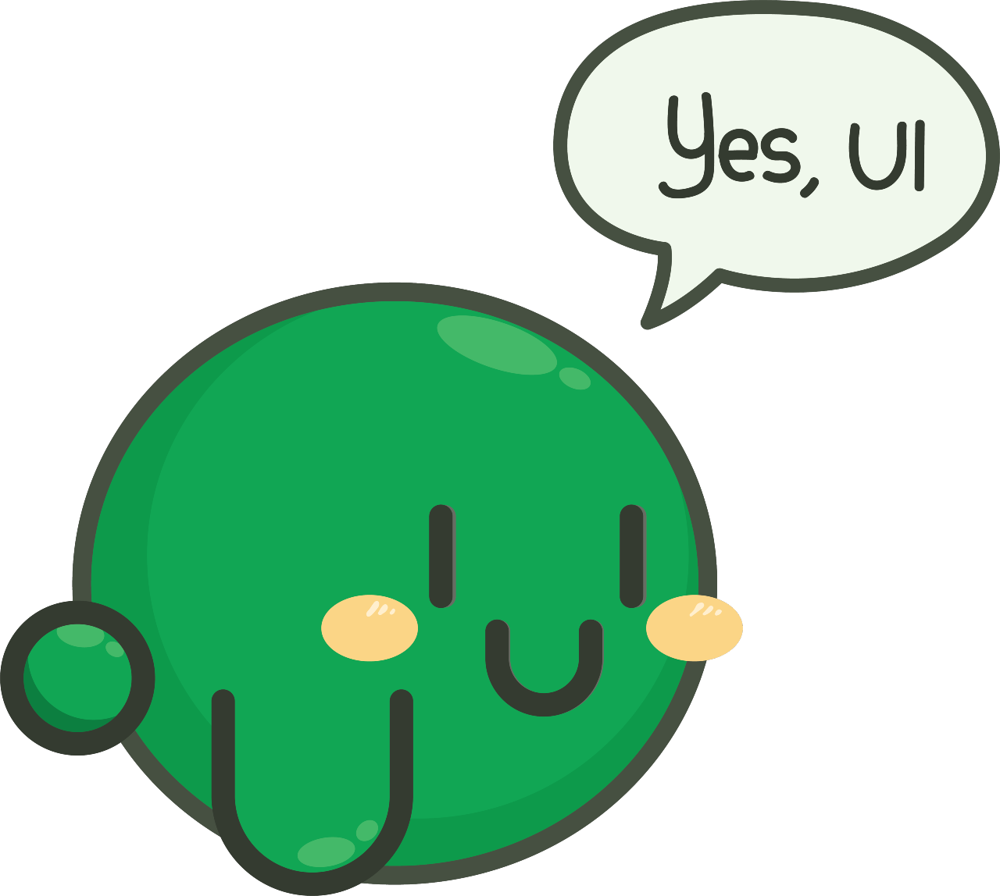

")

Web development often gets a bad rep about instilling our developers with a sense of JavaScript fatigue. At every stage of your journey you're confronted with dilemmas. Which language to use, which frameworks to use, how to scaffold your repo, how to create a testing strategy. The list goes on.

I wanted to create my own UI library but found myself faced with these dilemmas at every step. I felt overwhelmed, not because I *had* to do it all, but because I wanted to feel like I had done it right. Chances are that if you're reading this article series, you're feeling similarly.

This series will walk you through the dilemmas you'll face when creating a UI library, specifically a web component library. Why web components? I don't want to get into the web politics around web components, but here's why I chose them for my library:

- there's something alluring about throwing away the need for a JavaScript framework
- there's a lot of value in getting reacquainted with the fundamental browser technologies (HTML, CSS, Vanilla JS)

And if you're reading this, I'll assume that you somewhat agree.

Even by removing the need for a framework like Angular/React There's still a (custom) element (😅) of over-choice when choosing how [to](https://hybrids.js.org/#/) [develop](https://lit.dev/) [web](https://stenciljs.com/) [components](https://slimjs.com/#/welcome). And the dilemmas don't end there.

While it's far from complete, the outcome of my journey so far is the foundation for my UI library called [oui-ui](https://oui-ui.netlify.app/). Oui-ui is a library designed to implement the spec that the wonderful folks at Open UI are cooking up. If you have a passion for designing UI components and want to see some of the greatest in web dev discuss the future of native UI controls, please check out [Open UI](https://open-ui.org/).

Also, oui-ui has a mascot, how adorable is she?

## Before we go further

I should mention that this series **is not** a tutorial, so you won't find any:

- code snippets
- tips on writing web components
- deep dives into the specific technologies I bring up

Instead, this series focuses on the different dilemmas you might face when creating a component library. The series aims to provide enough guidance to help you make the right choice for your use-case, by presenting the problem space along with a handful of different solutions.

## How is this series structured?

I list the dilemmas I ran into, in the order in which I ran into them. I generally structure each dilemma in the following way:

- I explain what the problem is
- I share some possible solutions
- compare the benefits and drawbacks of each solution
- help you choose which solution might work best for you

I'll also cover some of the things that didn't go to plan, and what I learnt by trying them anyway.

When finding a solution for a dilemma, not only did I take a look at the available solutions, but I considered what I wanted to gain from this project. These goals manifested as two key principles:

- to dive deep into the fundamentals of web components
- to treat oui-ui as if it's will be a widely used component library

Defining core principles makes decision-making a lot easier, and you might want to do the same.

## Just before we begin...

I don't want this series to bestow developers with a sense of analysis paralysis. Very few of these dilemmas are *necessary* when creating your UI library. Just have fun writing code, and know that there are resources out there to help you when you reach a particularly tough dilemma. All of the resources I used for research can be found in the accompanying [GitHub repo](https://github.com/andrico1234/web-components-resources). If you used this article series to create your library, please open up an issue in the GitHub repo, and I'll be happy to add it to the showcase.

If I haven't scared you off, I recommend following the series in its written order, but you can jump to whichever dilemma interests you the most.

## Table of contents

[Scaffolding the repo for your UI library](/001-scaffolding-the-repo-for-your-ui-library)

[Tools to help you manage your monorepo](/002-tools-to-help-you-manage-your-monorepo)

[Tools to make writing your web components a breeze](/003-tools-to-make-writing-your-web-components-a-breeze)

[How to build (and maybe bundle) your UI library's packages](/004-how-to-build-and-maybe-bundle-your-UI-library)

[Creating your UI library's testing strategy](/005-defining-your-UI-librarys-testing-strategy)

[Versioning and publishing: getting your UI library into your user's hands](/006-versioning-and-publishing-getting-your-UI-library-into-your-users-hands)

[Creating documentation for your UI library](/007-creating-documentation-for-your-UI-library)

[Wrapping up: what's next for your UI library?](/008-conclusion-the-dilemmas-you'll-face-when-creating-a-web-component-library)

[Resources](https://github.com/andrico1234/web-components-resources)
