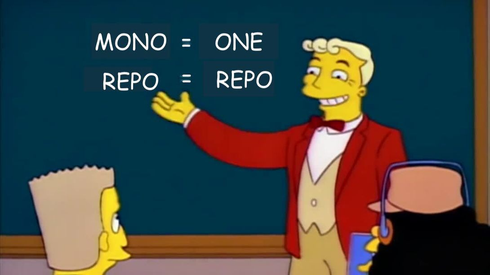

> This article is part 1 of the "The dilemmas you'll face when creating a web component library" series. If you haven't read the introduction yet, I'd recommend [giving it a read](/000-the-dilemmas-you'll-face-when-creating-a-web-component-library) first.

You've decided that you want to create a web component UI library. Great, that means you've thrown away the "which JavaScript framework do I use?" question. With that said, you're faced your first dilemma, how do you want your end-users to consume your library?

## Dilemma 0: Should your users consume your library as a global module or as scoped modules?

Thinking about your end users at this point might seem pre-emptive, but the answer to this question impacts how you structure your repo. The good news is you can always change things down the line if you decide your choice wasn't quite right.

What are your two options? There's the global module route, where your end-users simply install a single package. The alternative is to break your packages into smaller "scoped" modules, where smaller bundles of code are installable individually.

### Global modules

Libraries like [Ant Design](https://ant.design/) offer a core UI module that provide access to a few dozen components. You'd install via:

```bash
npm install antd
```

and import via:

```javascript
import { Button, Switch } from "antd"
```

### Scoped modules

Other libraries like [Material Web](https://material.io/components?platform=web) and [Lion WC](https://lion-web.netlify.app/) take a monorepo approach, where each component lives in its own sub-directory. This means that each component can be published and installed discretely. If you want to use both Lion's checkbox and button components, you'll need to install two separate packages:

```bash
npm install @lion/button @lion/switch
```

and import via:

```javascript
import { LionButton } from "@lion/button"
import { LionSwitch } from "@lion/switch"
```

### What are monorepos?



If you're not familiar with the monorepo architecture, it's a way to structure a single repository to encompass several projects. You can check out Dan Luu's [breakdown of monorepos](https://danluu.com/monorepo/) for more details. Monorepos are a common architecture choice for UI libraries as monorepos afford:

- Simplified dependency management
- Simplified organisation
- Cross-project changes
- Easier refactoring

You can also check out [Monorepos: A Multivocal Literature Review](https://www.researchgate.net/publication/328475148_Monorepos_A_Multivocal_Literature_Review) which compiles the learnings of dozens of publications on the subject of monorepos.

### What about libraries that mix both?

Libraries like [Chakra UI](https://chakra-ui.com/) and [Material UI](https://material-ui.com/) offer *react* or *core* scoped modules, which give end-users access to multiple components via a single module.

You might be concerned about your end-user's bundles containing unused components. The [Open WC](https://open-wc.org/guides/developing-components/publishing/) offers some best practices for publishing web components, one of which recommends you export your library as ESM. Doing so means your end-user can remove unused code during transpilation.

You can go one step further and allow your end-users to either install individual components or your entire component library. [Vaadin](https://vaadin.com/components) is one library that does just this.

### Which choice works best for you?

Why would you want to choose one over the other? Consider the following questions:

- Does your library incorporate an opinionated design language or encourage the use of several components?
- Do you want to avoid the complexity of creating and maintaining multiple packages?
- Do you expect your end-users to use only a handful of components?
- Do you want the freedom to version components separately? (we'll get to this more later)

If you answered yes to the first two questions, you'll want to consider exporting your components via a single package.

If you answered yes to the last two questions, you'll want to consider scoping your modules.

### Does your library incorporate a design language or encourage the use of several components?

Ant Design and Material UI are often viewed more as frameworks than libraries, as they're opinionated on how you design and build your UIs. If you're in for a penny, you're in for a pound.

For projects like Lion WC, which utilises a scoped modules approach, the library offers white-labeled components that an end-user can pick and choose from. This facilitates the workflow where a user may need a single component.

Don't let the arbitrary segregation deter you from doing something different entirely. [Wired Elements](https://github.com/rough-stuff/wired-elements) is a UI component library that exports all of the components from a single package.

### Do you want the freedom to version components separately?

A benefit of managing your components via a monorepo is that you'll be able to update individual components as they change, and not the entire library at once. We discuss this a little more in the article that tackles versioning.

## What did I choose?

For [oui-ui](https://oui-ui.netlify.app/), because I envision end-users to only use a handful of components, and to be able to manage component version independently, I chose to make each component its own package.

## Next steps

You may, or may not, have chosen to use monorepos for your UI library. If you did, then you're in luck. In the [next article](/002-tools-to-help-you-manage-your-monorepo), I'll help you choose the right tool to help you manage your monorepo. If you didn't choose to use a monorepo, then no worries! You can jump straight to the article after; [how to write your web components](/003-tools-to-make-writing-your-web-components-a-breeze).
