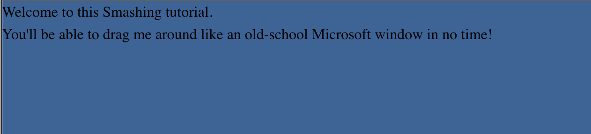
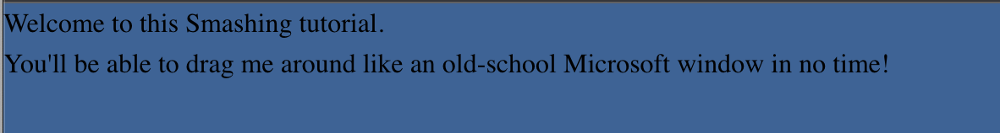
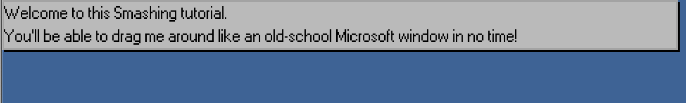
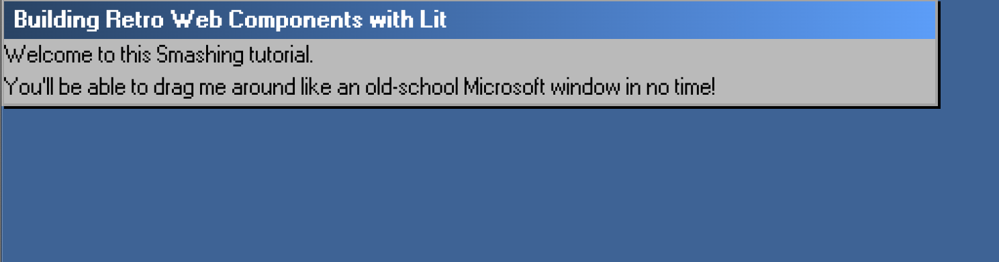
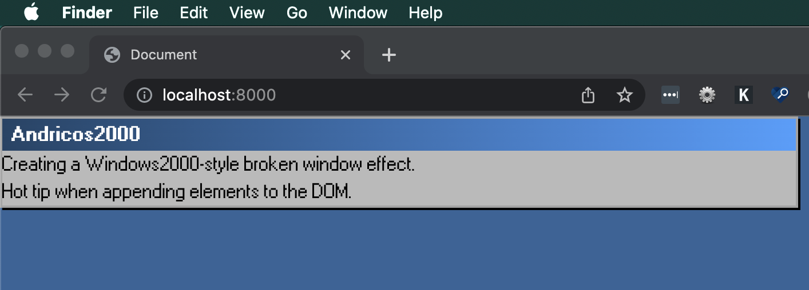
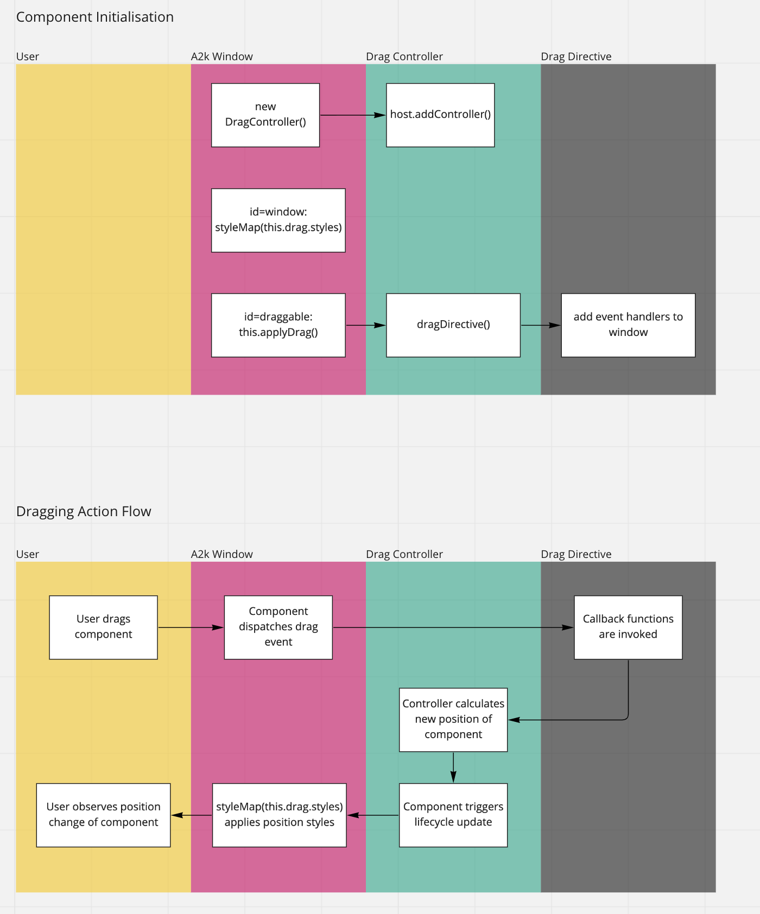
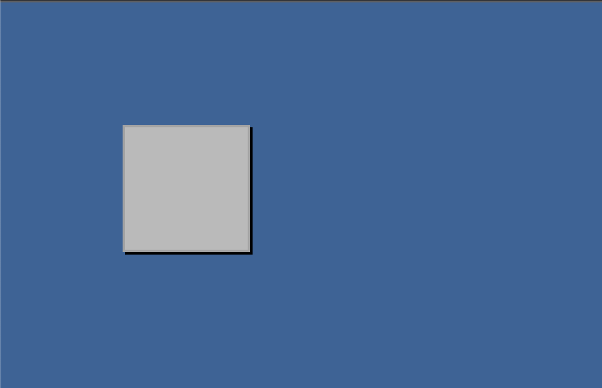

# Smashing Article Draft

## Introduction

Back in the 90s, my first operation system was Windows. Now in the 2020s, I work primarily on building web applications using the browser. Over the years, the browser’s transformed into a wonderful and powerful tool that supports a wide world of rich applications. Many of these [applications](https://web.dev/ps-on-the-web/), with their complex interfaces, and breadth of capabilities would make even the hardiest of turn-of-the-millennium programs blush.

Native browser features like web components are being adopted and used across the web by multi-national companies and individual developers alike.

<blockquote class="twitter-tweet"><p lang="en" dir="ltr">In case you’re wondering if anyone is using Web Components:<br><br>- GitHub<br>- YouTube<br>- Twitter (embedded tweets)<br>- SalesForce<br>- ING<br>- Photoshop web app<br>- Chrome devtools<br>- the complete Firefox UI<br>- Apple Music web client</p>&mdash; Danny Moerkerke (@dannymoerkerke) <a href="https://twitter.com/dannymoerkerke/status/1555682991413907456?ref_src=twsrc%5Etfw">August 5, 2022</a></blockquote> <script async src="https://platform.twitter.com/widgets.js" charset="utf-8"></script>

So why not embrace the technology of the present by paying homage to the interfaces of the past?

In this article(s), I hope to teach you just that by replicating the iconic _broken window_ effect.

// TODO videocast of the window in action, the same one I used to js conf

We’ll be using web components to build out this interface. We’ll use the Lit library to help us, as their API offers a nice way of building complex we components.

A lot of the concepts I talk about here are lessons I’ve learnt from building [A2k](https://a2000.netlify.app/), a UI library designed to help you create retro UI with modern tooling.

During this article(s) we’ll cover:

- The basics of creating web components using Lit
- How to easily customise your component’s behaviour using Lit’s built-in tools
- How to encapsulate reusable functionality
- How to dispatch and respond to events without the need to prop drilling

It’s worth knowing your core HTML, CSS, and some basic JavaScript to follow along with this tutorial, but no framework-specific knowledge is required.

## Getting Started

Let’s start by getting access to the repo and running it. To do this, run the following scripts:

- `git clone git@github.com:andrico1234/draggable-window-smashing-article.git`
- `cd draggable-window-smashing-article`
- `npm install`
- `npm start`

Your browser should open a new tab that points to the running server. If you’re seeing the following, then everything’s working as expected!



Next, open up the project in your editor of choice. Let’s have a quick look to see what our starter code looks like.

**index.html**

We have a very barebones HTML file that does little more than import some CSS and a JavaScript file.

You may have spotted a strange looking `a2k-window` window element. That’s not a valid HTML element, surely?

It’s not! In fact, it’s a custom element that we’ll build for this article. Since we haven’t created this component yet, the browser falls-back to the its inner HTML content.

**The various .js files**

I’ve added a little boilerplate for some of the components and functions, but we’ll fill in the gaps over the course of this article(s). I’ve imported all of the necessary first and third party code that we’ll use throughout this article.

**Bonus: fonts**

I’ve also added some retro fonts for fun! It’s a wonderful MS-2000-inspired font created by [Lou](https://www.notion.so/Smashing-Article-Draft-cd2335ccbe004b84a177c85d9ef966bd). You can download it and use it in your own projects if you’re looking to inject a little millennium flavour to your designs.

## Part 1: Building our first web component

### Writing our markup

The first thing we’re going to want to do, is get a convincing looking window element going. With just a few lines of code, we’ll have the following.



Let’s start by jumping into our `a2k-window.js` file. We’ll write a little boilerplate to get our component up and running.

We’ll need to define a class that extends Lit’s `LitElement` base class. By extending from `LitElement`, our class gets the ability to manage custom properties. We also need to implement a `render` function on the class that returns the DOM to render.

A really basic implementation of a class will look like this:

```jsx
class A2kWindow extends LitElement {
  render() {
    return html`
      <div id="window">
        <slot></slot>
      </div>
    `
  }
}
```

There are two things worth noting:

- We can specify an element ID which is then encapsulated within the web component. This means that duplicate IDs are not allowed within the same component, but other web components or external DOM elements can use the same ID.
- The `slot` element is a handy tool that acts as a placeholder that can render custom markup passed down from the parent. For those familiar with React, we can liken it to the `children` prop. There’s more that you can do with it, but that’s beyond the scope of this article.

Writing the above doesn’t make our web component available in our HTML. We’ll need to define a new custom element to make it globally available. Underneath our component class, write the following code:

```jsx
customElements.define("a2k-window", A2kWindow)
```

Now if we go ahead and jump back to our browser, we should expect to see our new component render to the page, but…


Even though our component has rendered, we’re seeing some plain unstyled content. Let’s go ahead and add some more HTML and CSS:

```jsx
class A2kWindow extends LitElement {
  static styles = css`
    :host {
      font-family: var(--font-primary);
    }

    #window {
      width: min(80ch, 100%);
    }

    #panel {
      border: var(--border-width) solid var(--color-gray-400);
      box-shadow: 2px 2px var(--color-black);
      background-color: var(--color-gray-500);
    }

    #draggable {
      background: linear-gradient(
        90deg,
        var(--color-blue-100) 0%,
        var(--color-blue-700) 100%
      );
      user-select: none;
    }

    #draggable p {
      font-weight: bold;
      margin: 0;
      color: white;
      padding: 2px 8px;
    }

    [data-dragging="idle"] {
      cursor: grab;
    }

    [data-dragging="dragging"] {
      cursor: grabbing;
    }
  `

  render() {
    return html`
      <div id="window">
        <div id="panel">
          <slot></slot>
        </div>
      </div>
    `
  }
}
```

There are a couple things worth noting in the above code:

- We define the styles scoped to this custom element via the `static styles` property. Due to how styles encapsulation works, our component won’t be affected by any external styles. However, we can use the CSS variables we’ve applied in our `styles.css` to apply styles from an external source.
- I’ve added some styles for DOM elements that don’t exist just yet, but we’ll add them soon.

<aside>
⚠️ A note on styles: There are a few differences when it comes to styling web components over regular HTML elements. To save the article from getting too large, I won’t elaborate dive any further into styling web components.

</aside>

If you refresh, you should see the following:



Which is starting to look more like our Windows-inspired web component. 🙌

<aside>
💡 Pro tip: If you’re not seeing the browser apply the changes you’re expecting. Open up the browser’s devtools. The browser might have some handy error messages to help you work out where things are failing.

</aside>

### Making our web component customisable

Our next step is to create the heading for our window component. A core feature of web components are custom properties which provide flexibility for the people using our components. Instead of hardcoding the text content of our window’s _heading_, we can make it a custom property.

To do this, we need to do three things:

1. Define the custom properties
2. Assign a default value
3. Render the value of the custom property to the DOM

First off, we need to specify the custom properties we want to enable for our component:

```jsx
class A2kWindow extends LitElement {
  static styles = css`...`;

  static properties = {
    heading: {},
  };

  render() {...}
}
```

We’ll do this by specifying the static `properties` object on our class. We then specify the names of the properties we want, along with some options passed through as an object. Since we don’t need to apply any options, we can leave it as an empty object.

Our next step is to assign a default value. We’ll do this within the component’s constructor method.

```jsx
class A2kWindow extends LitElement {
  static styles = css`...`;

  static properties = {...};

	constructor() {
    super();

    this.heading = "Building Retro Web Components with Lit";
  }

  render() {...}
}
```

<aside>
⚠️ Don’t forget to call `super()`!!

</aside>

And finally, let’s add a little more markup and render the value to the DOM:

```jsx
class A2kWindow extends LitElement {
  static styles = css`...`;

  static properties = {...};

	constructor() {...}

	render() {
    return html`
      <div id="window">
        <div id="panel">
          <div id="draggable">
            <p>${this.heading}</p>
          </div>
          <slot></slot>
        </div>
      </div>
    `;
  }
}
```

With that done, let’s jump back to our browser, and see how everything looks:



Very convincing! 🙌

### Bonus

Apply a custom heading from the `index.html` file. You can do this by treating the `heading` property just like any other HTML element property.

### Brief breather 😮‍💨

It’s wonderful to see how we can easily create custom components without requiring a JavaScript framework.



Designing a Windows interface, in a Google browser, within an Apple operating system

And we haven’t even gotten to the fun functionality yet! In the next sections, we’ll look into using some of Lit’s intermediate concepts to create drag functionality in a way that’s reusable across custom components.

## Part 2: Making our component draggable

This is where things get a little tricky! We’re moving into some intermediate Lit territory, so don’t sweat if not everything makes perfect sense.

Before we start writing the code, let’s have a quick rundown on the concepts that we’ll be playing with:

### Directives

As you’ve seen, when writing our HTML templates in Lit we write them inside of the the `html` literals tag. This allows us to use JavaScript to alter the behaviour of our templates. We can do things like evaluate expressions:

```jsx
html`<p>${this.heading}</p>`
```

We can return specific templates under certain conditions:

```jsx
html`<p>${this.heading ? this.heading : "Please enter a heading"}</p>`
```

In addition to evaluating JavaScript directly, we can use _directives_ to customise the way our templates render. Lit has a handful of built-in directives, and the one that we’ll be using is the `styleMap` directive. This allows us to apply styles directly to an element via a JavaScript object. The object is then transformed into the element’s inline styles. This will come in handy as we adjust the position of our window element, since the element’s position is managed by CSS properties.

In short, `styleMap` turns

```jsx
styleMap({
  position: "absolute",
  top: "50px",
  left: "100px",
})
```

into

```jsx
"position: absolute; top: 50px; left: 100px;"

```

We’ll also be writing our own directive to add event listeners on to the draggable element. The anatomy of this custom directive looks like the following (we’ll fill in the gaps later on):

```jsx
class DragDirective extends Directive {
  update(part, args) {...}

	render() {
    return noChange;
  }
}

const dragDirective = directive(DragDirective);
```

As we did for our component, we need to extend from a base class that Lit exports, this time it’s the `Directive` class. Once we extend the base class all we need to do is implement the `render` and `update` methods.

The update method is used to access and update the associated DOM element. We do this in the `update` and not the `render` method because we don’t have access to the element in the `render` method. The `update` method is where we’ll be adding the event listeners to our Window component.

The `render` method is a function whose value is rendered into the DOM. Since our custom directive won’t be rendering anything to the DOM, we just return the `noChange` value that Lit exports.

Finally we’ll need to turn our class into a directive function that we can use in our Lit expressions. To do that we’ll use `directive(DragDirective)`, where `directive` is a function we import from Lit.

### Controllers

Lit has a number of handy ways to compose complex components from smaller, reusable pieces of code.

One way is to build complex components from lots of smaller components, like so:

```jsx
class ComplexComponent extends LitElement {
  render() {
    return html`
      <outer-component>
        <inner-component>
          <slot></slot>
        </inner-component>
      </outer-component>
    `
  }
}
```

In the above example, we’re composing our ComplexComponent out of two pre-existing web components. A XXX component is one example a complex UI pattern made up of smaller, more atomic UI patterns.

// TODO get an example of this

Another way to compose complex logic is by encapsulating specific state and behaviour into a class. Doing so allows us to decouple specific behaviours from our markup. This can be done through the use of controllers, which have the added benefit of hooking into the component’s lifecycle.

With controllers, we can do some cool things, like say… using a controller to manage the drag state and position of its host component. Interestingly enough, that’s exactly what we plan to do!

While a controller might sound complicated, if we analyse its skeleton we’ll be able to make sense of what it is and what it does.

```jsx
class DragController {
  constructor(host, options) {
    this.host = host;
    this.host.addController(this);
  }

  hostDisconnected() {...}

  applyDrag() {
    return dragDirective(this, {
      start: this.#onDragStart,
      move: this.#onDrag,
    });
  }

	styles = {...}

  #onDragStart = (pointer, ev) => {...};

  #onDrag = (_, pointers) => {...};
}
```

We begin by initialising our controller by registering it with the host component and storing a reference to the host. In our case, the host element will be our `a2k-window` component.

Once we’ve done that, we can use lifecycle methods, like `hostConnected`, `hostUpdated`, `hostDisconnected` and more, to hook in to the host component’s lifecycle and run drag specific logic. In our case, we’ll only need to hook into `hostDisconnected` for clean up purposes.

Finally, we can add our own methods and properties to our controller that will be made available to our host component. Here, we’re making our custom directive available for our host component to invoke. We do this by providing the directive with a handful of callback functions that get invoked during the dragging lifecycle.

When these functions are invoked, we update our `styles` property, and can request that our host component re-renders. Since our host component turns this style object into inline css (via the `styleMap(this.drag.styles)` directive), our component will apply the new styles.

If this all sounds complicated, hopefully this flowchart better visualises the process.



### Writing our directive

In your `dragController.js` file, update the skeleton to include the following:

```jsx
class DragDirective extends Directive {
  hasInitialised = false;

  update(part, renderArgs) {
    if (this.hasInitialised) return;

    // our event listener logic

    this.hasInitialised = true;
  }

  render() {...}
}
```

You can see that we’re adding a `hasInitialised` guard into our directive. We only need to apply the event handlers once. However, if you remember from earlier, we only get access to the underlying DOM element in the `update` lifecycle method. So we add the guard to ensure we don’t perform the same logic on subsequent updates.

```jsx
class DragDirective extends Directive {
  hasInitialised = false;

  update(part, args) {
    if (this.hasInitialised) return;

    const draggableElement = part.element;
    const [dragController, pointerTrackerOptions] = args;

    draggableElement.setAttribute("data-dragging", "idle");
    dragController.draggableElement = draggableElement;

    // our event listener logic

    this.hasInitialised = true;
  }

  render() {...}
}
```

- We apply a `data-dragging` attribute to our component so that both the component can be made aware of the current dragging state. We can even use CSS selectors to change the cursor based on the dragging state. If `[data-dragging='idle']` then we show the grab cursor, if it’s `[data-dragging='dragging']` we show the grabbing cursor.

// TODO: Show screenshot of the above in action.

- We’re also setting references to the `draggableElement` to our controller. This will come in handy a little later when we set the element’s position.

```jsx
update(part, renderArgs) {
    if (this.hasInitialised) return;

    const draggableElement = part.element;
    const [dragController, pointerTrackerOptions] = renderArgs;

    draggableElement.setAttribute("data-dragging", "idle");
    dragController.draggableElement = draggableElement;

    dragController.pointerTracker = new PointerTracker(draggableElement, {
      start(...args) {
        pointerTrackerOptions.start(...args);
        draggableElement.setAttribute("data-dragging", "dragging");
        return true;
      },
      move(...args) {
        pointerTrackerOptions.move(...args);
      },
      end(...args) {
        draggableElement.setAttribute("data-dragging", "idle");
      },
    });

    this.hasInitialised = true;
  }
```

Finally, we use the `PointerTracker` library to easily track pointer events. It’s much more pleasant to use this library than to write the cross-browser, cross-input mode logic to support pointer events.

`PointerTracker` requires two arguments, the `draggableElement`, and an object of functions that act as the event handlers for the dragging events.

`start` - gets invoked when we the pointer is pressed down on the draggableElement

`move` - gets invoked when drag the draggableElement around

`end` - gets invoked when we release the pointer from the draggableElement

For each, we’re either updating the `data-dragging` state, invoking our controller’s callback, or both.

Like with the `draggableElement`, we assign a reference to the `pointerTracker` instance to our controller, which we’ll use later.

If you had trouble following along, our entire directive looks like the following:

```jsx
class DragDirective extends Directive {
  hasInitialised = false

  update(part, args) {
    if (this.hasInitialised) return

    const draggableElement = part.element
    const [dragController, pointerTrackerOptions] = args

    draggableElement.setAttribute("data-dragging", "idle")
    dragController.draggableElement = draggableElement

    dragController.pointerTracker = new PointerTracker(draggableElement, {
      start(...args) {
        pointerTrackerOptions.start(...args)
        draggableElement.setAttribute("data-dragging", "dragging")
        return true
      },
      move(...args) {
        pointerTrackerOptions.move(...args)
      },
      end(...args) {
        draggableElement.setAttribute("data-dragging", "idle")
      },
    })

    this.hasInitialised = true
  }

  render() {
    return noChange
  }
}
```

### Writing our controller

Arguably the most technical part of the article, let’s wire up our controller!

Let’s begin by completing the initialisation logic of our controller:

```jsx
export class DragController {
  styles = {
    position: "absolute",
    top: "0px",
    left: "0px",
  };

  constructor(host, options) {
    const { containerId = "" } = options;

    this.host = host;
    this.host.addController(this);
    this.containerId = containerId;
  }

  hostDisconnected() {...}

  applyDrag() {
    return dragDirective(this, {
      start: this.#onDragStart,
      move: this.#onDrag,
    });
  }

  #onDragStart = (pointer) => {...};

  #onDrag = (_, pointers) => {...};
}
```

The two difference between this snippet and the skeleton we analysed earlier is the addition of the styles object and options argument. We access the `containerId` from the options object and store it on the instance.

Let’s start adding logic to the class’s functions. We’ll start with the `#onDragStart` function:

```jsx
#onDragStart = (pointer, ev) => {
  this.cursorPositionX = Math.floor(pointer.pageX)
  this.cursorPositionY = Math.floor(pointer.pageY)
}
```

Here we’re storing the current position of the cursor, which we’ll use in the `#onDrag` function.

```jsx
#onDrag = (_, pointers) => {
  this.calculateWindowPosition(pointers[0])
}
```

When the `#onDrag` function is called, it’s provided a list of the active pointers in flight. Since we’ll only catering for one window being dragged at a time, we can safely just access the first item in the array. We’ll then send that through to a function that determine’s the new position of the element. Strap in, because it’s a little wild…

```jsx
calculateWindowPosition(pointer) {
    const el = this.draggableElement;
    const containerEl = this.host.shadowRoot?.querySelector(this.containerId);

    if (!el || !containerEl) return;

    const { top, left } = this.styles;

    // These values exist as strings on the styles object, we need to parse them as numbers
    const parsedTop = Number(top?.replace("px", ""));
    const parsedLeft = Number(left?.replace("px", ""));

    // JavaScript's floats can be weird, so we're flooring these to integers
    const cursorPositionX = Math.floor(pointer.pageX);
    const cursorPositionY = Math.floor(pointer.pageY);

    const hasCursorMoved =
      cursorPositionX !== this.cursorPositionX ||
      cursorPositionY !== this.cursorPositionY;

    // We only need to do calculate window position if the cursor position has changed
    if (hasCursorMoved) {
      const { bottom, height } = el.getBoundingClientRect();
      const { right, width } = containerEl.getBoundingClientRect();

      // The difference between the cursor's previous position and its current position
      const xDelta = cursorPositionX - this.cursorPositionX;
      const yDelta = cursorPositionY - this.cursorPositionY;

      const { availWidth, availHeight } = screen;

      const outOfBoundsTop = parsedTop + yDelta < 0;
      const outOfBoundsLeft = parsedLeft + xDelta < 0;
      const outOfBoundsBottom = bottom + yDelta > availHeight;
      const outOfBoundsRight = right + xDelta >= availWidth;

      const isOutOfBounds =
        outOfBoundsBottom ||
        outOfBoundsLeft ||
        outOfBoundsRight ||
        outOfBoundsTop;

      // Set the cursor positions for the next time this function is invoked
      this.cursorPositionX = cursorPositionX;
      this.cursorPositionY = cursorPositionY;

      // The happy path, if the draggable element doesn't attempt to go beyond the browser's boundaries
      if (!isOutOfBounds) {
        const top = `${parsedTop + yDelta}px`;
        const left = `${parsedLeft + xDelta}px`;

        this.updateElPosition(left, top);
      } else {
        // Otherwise we force the window to remain within the browser window
        if (outOfBoundsTop) {
          const left = `${parsedLeft + xDelta}px`;

          this.updateElPosition(left, "0px");
        } else if (outOfBoundsLeft) {
          const top = `${parsedTop + yDelta}px`;

          this.updateElPosition("0px", top);
        } else if (outOfBoundsBottom) {
          const top = `${availableHeight - height}px`;
          const left = `${parsedLeft + xDelta}px`;

          this.updateElPosition(left, top);
        } else if (outOfBoundsRight) {
          const top = `${parsedTop + yDelta}px`;
          const left = `${Math.floor(availableWidth - width)}px`;

          this.updateElPosition(left, top);
        }
      }

      // We trigger a lifecycle update
      this.host.requestUpdate();
    }
  }
```

It’s certainly not the prettiest code, and I’m no mathematician, so I’m sure there’s a cleaner way of calculating the element’s new position. With that being said, I’ve tried my best to annotate the code to make it clear what’s going on.

To summarise:

- When the function gets invoked, we check to see that both the draggableElement and containerElement are available
- We then parse the position of the element and cursor.
- We then calculate whether the cursor’s moved. If it hasn’t, we do nothing
- We determine whether or not the next position of the element tries to break the bounds of the window.
  - If it doesn’t, then we update the element’s position.
  - If it does, then we force the element within the confines of the window.
- We then trigger the host’s update lifecycle function.

Review the function a few times to make sure you’re confident about what it does. There’s a lot going on, so don’t sweat if it doesn’t soak in straight away.

The `updateElPosition` function is a small helper on the class to apply the styles to the `styles` property.

```jsx
updateElPosition(x, y) {
  this.styles = {
    ...this.styles,
    left: x,
    top: y,
  };
}

hostDisconnected() {
  if (this.pointerTracker) {
    this.pointerTracker.stop();
  }
}
```

We also need to add a little cleanup to ensure that we stop tracking if our component happens to disconnect whilst being dragged.

Finally, we need to jump back to our `a2k-window.js` file, and do three things:

- Initialise the controller
- Apply the position styles
- Apply the drag event listeners

These are the three things specified in the flowchart from earlier. Review the code chart, and see if you can implement the above changes yourself. I’ll also post the solution below:

```jsx
class A2kWindow extends LitElement {
  static styles = css`...`;

  static properties = {...};

  constructor() {...}

  drag = new DragController(this, {
    containerId: "#window",
  });

  render() {
    return html`
      <div id="window" style=${styleMap(this.drag.styles)}>
        <div id="panel">
          <div id="draggable" ${this.drag.applyDrag()}>
            <p>${this.heading}</p>
          </div>
          <slot></slot>
        </div>
      </div>
    `;
  }
}
```

Once this is all completed, you should be able to jump back into the browser and drag your component around, like so:

// TODO: add video of me drag component around

## Part 3: Creating the _broken window_ effect

Our component is now pretty self-contained, which is great. If we wanted, we could use this window element anywhere in our site and we can drag it about without relying on any external code.

And since we’ve created a reusable controller to handle all of the drag functionality, we can add that behaviour to future components, like a desktop icon.

Now let’s start building out that cool _broken window_ effect when dragging our component.

We could bake this behaviour inside of the window element itself, but it’s not really useful behaviour outside of a very specific use-case, i.e. making a cool visual effect. Instead, we can get our drag controller to emit an event whenever the `#onDrag` callback is invoked. This means that anyone using our component can listen to the drag event and do whatever they want.

To create the broken window effect, we’ll need to do 2 things:

- Dispatch and listen to the drag event
- Add the broken window element to the DOM.

### Dispatching and listening to events in Lit

Lit has a handful of different ways to handle events. You can add event listeners directly within your templates, like so:

```jsx
handleClick() {
	console.log("Clicked");
}

render() {
	html`<button @click="${this.handleClick}">Click me!</button>`
}
```

For those with a React background, this pattern may feel familiar to you. We’re defining the function that we want to fire on button click and passing it through to the element, which will be invoked on click. This is a perfectly viable option, and it’s the approach I’d use if the element and callback are located close together.

As I mentioned earlier, we won’t be baking the _broken window_ behaviour into the component, so passing down event handlers through a number of different web components would become cumbersome. Instead, we can leverage the native window event to dispatch an event somewhere in the DOM and have any of its ancestors listen and respond.

```jsx
// Event Listener
class SpecialListener extends LitElement {
  constructor() {
    super()

    this.specialLevel = ""
    this.addEventListener("specialClick", this.handleSpecialClick)
  }

  handleSpecialClick(e) {
    this.specialLevel = e.detail.specialLevel
  }

  render() {
    html`<div>
			<p>${this.specialLevel}</p>
			<special-button>
		</div>`
  }
}

// Event Dispatcher
class SpecialButton extends LitElement {
  handleClick() {
    const event = new CustomEvent("specialClick", {
      bubbles: true,
      composed: true,
      detail: {
        specialLevel: "high",
      },
    })

    this.dispatchEvent(event)
  }

  render() {
    html`<button @click="${this.handleClick}">Click me!</button>`
  }
}
```

We have two components, a listener and a dispatcher. The listener is a very basic web component that adds an event listener to itself. It listens to `specialClick` and outputs the value passed through in the event’s `detail` object.

Our second component, `SpecialButton`, is a descendant of `SpecialListener`. It’s a component that dispatches an event when the button is clicked. The code inside of the `handleClick` method is interesting, so let’s understand what’s going on here:

- We create an event object by creating an instance of `CustomEvent`
- The first argument of `CustomEvent` is the name of the event we want to dispatch, in our case it’s `specialClick`.
- The second argument of `CustomEvent` is the options argument. Here we’re setting three options: `bubbles`, `composed`, and `detail`
- Setting `bubbles` to true allows our event to flow up the DOM tree to the component’s ancestors.
- Setting `composed` to true allows our event to be dispatched above the element’s shadow DOM.
- Finally we dispatch our event by firing off the `this.dispatchEvent(event)`.

Once this happens, the listener will react to the event by invoking `handleSpecialClick` callback.

Let’s go ahead and dispatch events from our drag controller. We’ll want to create an instance of `CustomEvent` with an event name of `windowDrag`. We’ll want to set the `composed` and `bubbles` options to true.

We’ll then create the `detail` option with a single property: `containerEl`. Finally we’ll want to dispatch the event.

Go ahead and try to implement this logic inside of the `#onDrag` function. I’ll leave a couple of hints below before offering the solution

<aside>
💡 Hint 1: Don’t forget that we’re in our controller, so the `this` keyword points to the instance of the controller, not to our host component. You’ll need to dispatch the event through the host element.

</aside>

<aside>
💡 Hint 2: To get the `containerEl`, we’ll need to use the `containerId` that we passed through as an argument. We can get the element by querying the host’s shadow root. You can use `shadowRoot.querySelector(query)` to get you part of the way there

</aside>

Before I go ahead and spoil the answer, let’s get our listener set up. That way we’ll be able to determine whether we’ve wired up our event dispatcher correctly.

Jump into the `script.js` file and add the following lines:

```jsx
function onWindowDrag() {
  console.log("dragging")
}

window.addEventListener("windowDrag", onWindowDrag)
```

You can now jump into your browser, drag your element, and view the logs in the console.

You can check your solution against mine below:

```jsx
#onDrag = (_, pointers) => {
  const el = this.draggableElement
  const containerEl = this.host.shadowRoot?.querySelector(this.containerId)

  const event = new CustomEvent("windowDrag", {
    bubbles: true,
    composed: true,
    detail: {
      containerEl,
    },
  })

  this.host.dispatchEvent(event)
  this.calculateWindowPosition(pointers[0])
}
```

Great! The only thing left to do is add the broken window element to the DOM every time we receive a drag event.

We’ll need to create a new component broken window component that looks like the following:

// TODO add image of the broken window component

Our broken window should look little more than our regular window without any content. The markup for the component is going to be very straightforward. We’ll have nested divs, each responsible for different aspects of the element.

- The outer-most div will be responsible for position
- The middle div will be responsible for appearance
- The inner-most div will be responsible for width and height.

Here’s the markup for our broken window:

```jsx
render() {
  return html`
    <div
      style=${styleMap(...)}
      id="outer-container"
    >
      <div id="middle-container">
        <div
          style=${styleMap(...)}
        ></div>
      </div>
    </div>
  `;
}
```

We’ll also need to add a little basic styling too:

```jsx
static styles = css`
  #outer-container {
    position: absolute;
    display: flex;
  }

  #middle-container {
    border: var(--border-width) solid var(--color-gray-400);
    box-shadow: 2px 2px var(--color-black);
    background-color: var(--color-gray-500);
  }
`;
```

As for the rest of the component’s boilerplate, I’ll leave it with you to implement. (Don’t forget to to register the component).

The very last thing we need to do is to define 4 properties: `top`, `left`, `height`, and `width`. These properties will be passed down when we add our element to the DOM. If you remember, back in the first part of the article we learned how to add custom properties to our components.

Once you’ve created the properties, we’ll need to pass `top` and `left` to our outer container’s `styleMap` function, and we need to pass `width` and `height` to our inner container’s `styleMap` function.

We can check that our component is working correctly by adding the following to our index.html file:

```jsx
<a2k-broken-window
  top="100px"
  left="100px"
  width="100px"
  height="100px"
></a2k-broken-window>
```

If you see the following in your browser then congratulations! You’re broken-window is working perfectly.



### Bonus

You may have noticed that, both our a2k-window component and our a2k-broken-window component share a lot of the same styles. We can leverage one of Lit’s composition techniques to abstract out the repeated markup and styles into a separate component. Once we’ve done that we can reuse that component in our window components.

I won’t give away the answer here but if you want to give it a shot, the [Lit documentation](https://lit.dev/docs/composition/component-composition/) will help if you get stuck.

### Rendering our broken window on drag

We’re finally at the last hurdle of our retro web component journey.

To create our broken window effect, we only need to do a handful of things:

- Listen to the `windowDrag` event
- Get access to the container’s styles
- Create a new `a2k-broken-window` element
- Set the `top`, `left`, `height`, `width` attributes to our new element
- Insert the broken-window into the DOM.

Let’s jump into our `script.js` file

```jsx
function onWindowDrag(e) {
	...
}

window.addEventListener("windowDrag", onWindowDrag);
```

We’re listening to the `windowDrag` event, and setting up callback that receives the event object when invoked.

```jsx
function onWindowDrag(e) {
  const { containerEl } = e.detail
  const { width, top, left, height } = getComputedStyle(containerEl)
}

window.addEventListener("windowDrag", onWindowDrag)
```

The above bit of code is doing two things:

- Accessing the `containerEl` from the detail object.
- We’re then using the window’s `getComputedStyle` function, which returns the element’s CSS properties into a JavaScript object. We then access all the styles we need.

```jsx
function onWindowDrag(e) {
  const { containerEl } = e.detail
  const { width, top, left, height } = getComputedStyle(containerEl)

  const newEl = document.createElement("a2k-broken-window")

  newEl.setAttribute("width", width)
  newEl.setAttribute("top", top)
  newEl.setAttribute("left", left)
  newEl.setAttribute("height", height)
}
```

Here we’re imperatively creating our broken window element and applying our styles. For anyone familiar with writing HTML with JavaScript (or even jQuery), this shouldn’t be a foreign concept. The last thing we need to do is add our component to the DOM.

We need to be very specific about where we want to place the element. We can’t just append it to the body otherwise it’ll cover our main window element.

We also can’t write it as the first element of `body`, otherwise the oldest window will appear above the newer windows.

// TODO add a screenshot of this

One solution is to the add our component into the DOM just before our container element. All the JavaScript devs out there might be eager to write their own script to manage this but luckily the window has the perfect function for us:

```jsx
containerEl.insertAdjacentElement("beforebegin", newEl)
```

The above is a very handy function (that I only learned about when writing this article), that gives a lot of control around where an element gets added. This script specifically inserts our new element before our container element begins.

Our finished script looks like this:

```jsx
function onWindowDrag(e) {
  const { containerEl } = e.detail
  const { width, top, left, height } = getComputedStyle(containerEl)

  const newEl = document.createElement("a2k-broken-window")

  newEl.setAttribute("width", width)
  newEl.setAttribute("top", top)
  newEl.setAttribute("left", left)
  newEl.setAttribute("height", height)

  containerEl.insertAdjacentElement("beforebegin", newEl)
}

window.addEventListener("windowDrag", onWindowDrag)
```

Jump back to the window and start dragging your window. You should be now seeing your cool window effect!

If your script isn’t working, then don’t worry! Open up your console and see if you can debug the problem(s). You can even run through the code snippets above and make sure that everything’s been copied over correctly.

## Wrapping up

### Bonus

We’ve made a cool draggable effect by listening to the drag events and writing some custom logic inside of the handlers.

But Microsoft did this 20 years ago. I’d love to see what cool effects the creative Smashing community can whip up instead! Something like this?

// TODO Create a tile effect that creates a rainbow color,

## Conclusion

Thanks for making it to the end! We covered a lot of ground. I hope it’s helped you get comfortable writing web components with the wonderful Lit library. Most importantly, I hope you’ve had fun joining me in building something fun.

The draggable window is part of my web component UI library, [Andricos2000](https://a2000.netlify.app/), which you can use in your own projects. Learn how to give it a whirl by heading over to the [GitHub repo](https://github.com/andrico1234/a2k).

If you’d like to support the project, you can follow me on [Twitter](https://twitter.com/andricokaroulla) for updates, or leave the repo a GitHub star.

## Resources

[Lit docs](https://lit.dev/docs/)

[Photoshop on the web](https://web.dev/ps-on-the-web/)

## Future article ideas

- Making it more accessible by allow for additional input modes
- Adding a window context to manage multiple windows + stacking.
