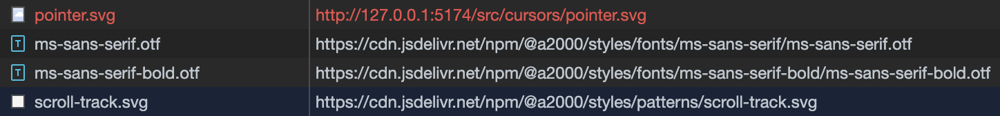

I recently came across an issue while working on my UI library, [a2k](https://a2000-docs.netlify.app/). Like with many UI libraries, there are two distinct halves to a2k:

- The core CSS stylesheet that sets the variables, defines some utility classes, and applies global styles.
- The suite of fully-functional, interoperable web components.

In addition to setting the styles and variables, the stylesheet is also responsible for resolving static assets, like the cursor images, background patterns, and fonts.

Recently, during development I noticed something strange when consuming the stylesheet via a CDN. Sometimes my CSS urls would resolve to the correct static assets from the CDN. Other times the request would return a 404 because the browser is trying to resolve the file via the site’s root, not via the CDN.



All the URLs are defined in the same stylesheet, so what gives?

Here’s a repro case of the problem in question:

```css
/* @a2000/styles/a2k-styles.css */
@font-face {
  font-family: "Pixelated MS Sans Serif";
  src: url("fonts/ms-sans-serif/ms-sans-serif.otf") format("opentype");
  font-weight: normal;
  font-style: normal;
}

:root {
  --cursor-default: url("cursors/default.svg") 0 0, default;
}

::-webkit-scrollbar-track {
  background: url("patterns/scroll-track.svg");
}
```

```jsx
/* @a2000/button/a2k-button.js */
class A2kButton extends LitElement {
	static styles = css`
	    button {
	      cursor: var(--cursor-pointer);
	    }
	  `;
	
	  render() {
	    return html` <button>
	      <slot></slot>
	    </button>`;
	  }
	}
```

You can see I’m assigning the destination of the cursor image to the `--cursor-default` variable. I’m then referencing that variable from within the button component.

So what’s the problem?

<aside>
💡 Hint: The stylesheet is being imported via CDN but the components are being imported via node_modules.
</aside>

## URLs as CSS variables

After hitting my head against this problem for a couple of hours, I decided to do some digging into the [CSS variables spec](https://www.w3.org/TR/css-variables-1/#syntax). Fortunately, the spec quickly described some of the gotchas related to using CSS variables.

The CSS spec is very generous with the allowed values that can be used for a custom property. This is because the CSS specs assumes that the values could be read via JavaScript, so the values don’t necessarily need to be valid or complete CSS.

Since variables may be not be interpretable by the CSS parser, the values are generally unresolved until they’re referenced with the `var()` keyword. In other words, variable values aren’t evaluated at declaration time, they’re evaluated when referenced.

As a result, when a variable is declared with a `url()`, the value is unresolved until referenced with a `var()` function.

This leads us to the problem we observed at the beginning. `url()`s used as variables are resolved against the base URL of the stylesheet that they’re referenced in.

So for our fonts, which are declared in the stylesheet hosted at `[https://cdn/@a2000/styles/a2k-styles.css](https://cdn/@a2000/styles/a2k-styles.css)` , the url resolves to [`https://cdn/@a2000/styles/fonts/ms-sans-serif.otf`](https://cdn.jsdelivr.net/npm/@a2000/styles/fonts/ms-sans-serif/ms-sans-serif.otf)

For our cursors, which we declared in the stylesheet hosted on the same CDN but are referenced from `https://a2000.co/assets/index.js`, the url resolves to `https://a2000.co/assets/cursors/pointer.svg`.

This file doesn’t exist because the cursor lives on the CDN, which results in our 404.

## Solution: Be consistent with where you’re importing your assets

The problem was caused by me importing my stylesheet from a CDN while importing my components from the node_modules.

I solved this problem by importing my stylesheet from the node_modules instead of the CDN.

## Thanks for reading

This tripped me for a long time, and while I’m glad have a quick look into the CSS spec provided me with the answers I needed, I still spent a little too much time on this.

I hope this helps others that come across the same problem.