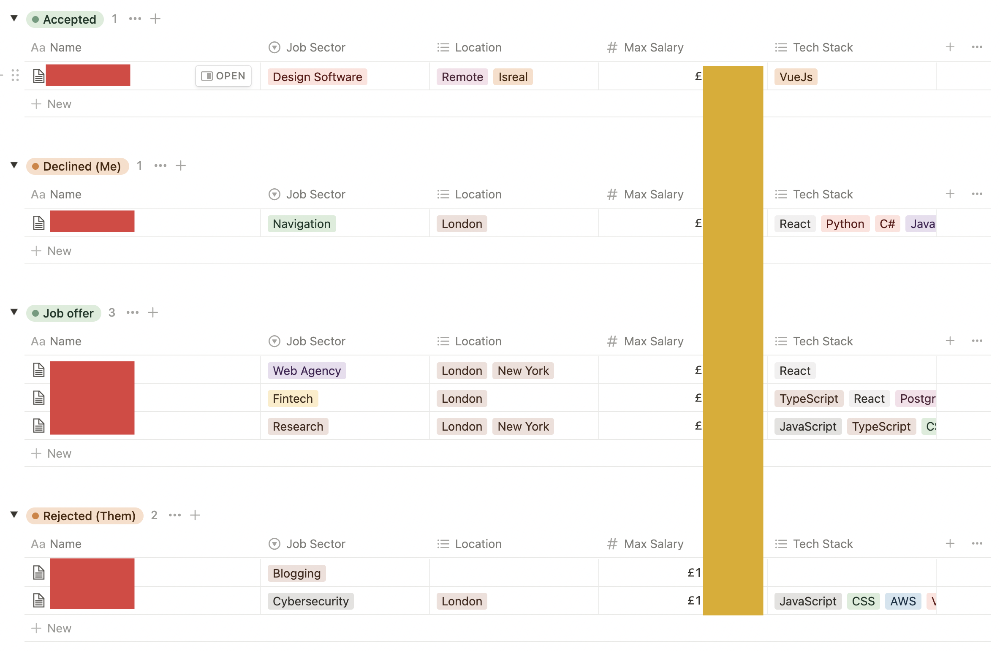
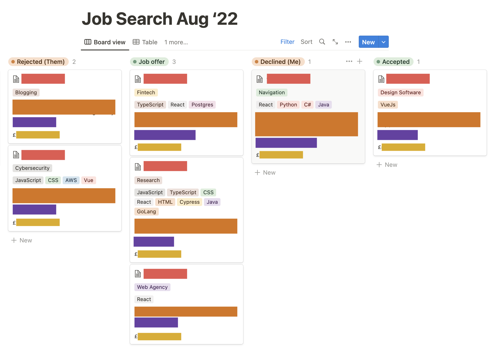

I’ve used Notion in almost every part of my life for several years now.

I’ve used it for tracking of my day-to-day, tracking long-term projects, personal journaling, holiday planning, and much more.

So it made perfect sense that I used as a core part of the job hunting process as I searched for a new job.

In short, I used Notion to:

- Track the state of each job application
- Build a database and capture structured information for each application
- Keep a synced list of all my skills, personal values, and experiences

The results of my job hunt were 4 job offers, one of which I accepted. While job hunting is a long and arduous process that requires a lot of research, practice, and planning, my Notion workflow really helped keep me on top of everything.

There were three standout features in particular that helped me achieve this.

## Synced Blocks

While Notion shines at easily linking between pages, there are often times when you want to display the same information in two separate pages.

The obvious solution to this problem is to copy and paste said information where it’s needed.

Within the context of job searching, this doesn’t work. For each job application, I list out the core skills specified in the job spec. As a web developer, HTML, CSS, and JavaScript are listed in every spec.

I have a *skills* page that outlines my key skills, along with any relevant examples. Under HTML, I might elaborate on my competencies with the following:

“I build the structure of a web page using semantic HTML as it’s fundamental to an accessible web experience.“

I don’t just want to display this in the skills page, but inside any relevant job application pages. That way I always have access to it at the right time. However, if I decide to reword the phrase, I will have to do so in every page I’ve copied it into. If I have a few dozen applications on the go, I would have to change this sentence in a few dozen places.

This is what _synced blocks_ solve*.* With synced blocks, I can write content in one page, display it in multiple locations, and then edit it from anywhere and have the changes reflected in all locations.

Here are synced blocks in action:

<video controls style="width:100%;">
  <source src="https://public-images-and-stuff.s3.amazonaws.com/notion-synced-blocks.mov" type="video/mp4" />
</video>

## Database

Every job application has a dedicated Notion page. Each page contains all sorts of information like:

- Company name
- Salary range
- Application status
- Tech stack
- Vision statement
- Office location
- and more…

Instead of dumping all of this information as free text in a page, I created a job application database. The job application database is a collection of several dozen job application pages. One of the most useful database features is _properties_, which provide data about each page. You can define the database’s properties along with its value’s data type. For instance, the company name should be free text, the salary should be a currency, the status should be a single-select value, and the tech stack should be a multi-select value.

By applying the above settings to the job application database, I get the following table view for free:

Every page shares the same schema for the data points, which it makes it very easy to apply some pretty powerful filters to create useful views.

Here’s a view that groups all the application by its current status:

## Board View

Custom database views are more than just sorting and filtering a table. In fact, Notion provides many different view types, including the _board view_.

For a process like job hunting, a board view makes perfect sense, since each application moves along through a set of stages:

- Pre-apply
- Applied
- Interviewing
- Job Offer
- Declined
- Rejected
- Accepted
- No Response

The best thing about the board view is that it comes for free with any database. Since the board view uses the same data as the table view, any changes made in one view are reflected in the others.

For those that have used software like Trello and Jira in the past, this view of the data should be very familiar to you:

It’s scientifically proven\* that moving cards along a board view is the most satisfying way of managing any project.

\*citation needed

## Wrapping up

I’ve been using Notion for a few years now, but I’m still impressed with how easily it fits into so many different workflows.

I’m a big believer in not spending too much time fiddling with productivity tools, as it can distract me from actually being productive. That’s why I’m a big fan of Notion, since the features I outlined are core to the Notion experience, meaning you get them out of the box.

If you’re haven’t used Notion much, I hope that I’ve shown you some new features, along with a few ways Notion can help with your job search.

Please let me know of any cool Notion workflows you’ve used. You can reach out to me on Twitter.
