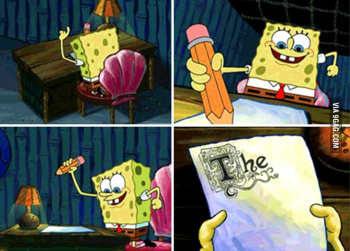

As the market for tech jobs becomes increasingly competitive, the importance of distinguishing yourself from other applicants only grows.

I recently found myself back job hunting and this time I wanted to take a different approach to what I’ve done previously. My goal was to write fewer applications but to spend more time writing higher-quality applications for the roles that interest me the most.

Even after taking the time to find a great role I still had to prove to the talent rep that I was worth interviewing. For me, one great way of distinguishing myself from dozens (or even hundreds) of other applicants, is to write a cover letter.

In this article, I’ll share a way of writing cover letters that I feel has helped me in my job search in the past.

<aside>
💡 Note: While I believe the contents of this article will help many write their own cover letters because the roles I apply for are Frontend Developer roles, there will be anecdotes and advice specific to that job space.
</aside>

## What is a cover letter?

A cover letter is a companion document to your CV that’s sent to the talent rep for a given role.

Each cover letter is bespoke for the role at hand and is shaped to demonstrate why you’re an excellent candidate for the role. It’s **not** supposed to be a generic page that gets thrown along with your CV. By making it bespoke, you can build a convincing case for why you’re an excellent candidate for a particular role, so tailor it to the role at hand.

## Why is a cover letter important?

As we’ve just mentioned, a well-written cover letter communicates why you’re an excellent candidate for the role. It shows that you’ve taken the time to research and understand what the company’s about and what the role entails. If done right, you’ll also present how your skills and experience will help contribute to the company’s success.

A cover letter isn’t only for the benefit of the recipient but also for you as an applicant. I’ve been writing fewer applications but investing more time in each. Because of this, it’s important to recognise when **not to apply** for a job. By taking the time to research a role you can understand better whether it’s a role you want to pursue. While there are going to be jobs that you’re an excellent fit for, there are going to be just as many where you’re not, and there’s nothing wrong with that. It could be due to:

- Skills mismatch
- Culture mismatch
- A problem space that doesn’t excite you
- The remuneration isn’t enough
- Or any other reason

<video controls style="width:100%;">
  <source src="https://public-images-and-stuff.s3.amazonaws.com/what-do-we-create-small.mp4" type="video/mp4" />
</video>

Applying for lots of jobs is great for upping your job-hunting skills but a mistake I’ve made is having too many applications in flight which can lead to burnout. Burnout isn’t worth having to begin with but it’s even worse when you’re spending time interviewing for roles you don’t care about.

I also feel that cover letters have a different degree of importance depending on the stage of your career. Folks that have been in their careers for a few years will have accumulated a unique set of skills and experiences. For example:

- Before tech, you may have been a touring musician
- You may have learned to code to make your own website
- You may have landed your first job as a frontend developer
- You may have spent 3 years in the role, with the last 6 months specialising in frontend performance
- You may have then had a lateral role change to become an iOS developer

If you’re applying for a new role to build a native application with a heavy focus on sleek and snappy user interfaces, you’ll be able to provide some concrete examples in your cover letter on how you could help your prospective employer create a world-class iOS app.

In short, not many people will have had the exact same job trajectory as you, so explaining how your unique experiences (something that no other person can have) can help solve the company’s problems will set you apart from other candidates.

## How to write a cover letter

### Doing some intelligence gathering

So great, let’s give my advice a try. You open up a blank page in Google Docs with the hope of spewing out a couple hundred words for your dream role. And after 15 minutes… nothing!

I often find that opening a blank page to write several paragraphs about why I’m great is an easy way to spend lots of time achieving nothing.

Before I write the cover letter, I like to do a little intel gathering. I’ll dedicate around 30 minutes to this stage of the process. In fact, I’ve often spent more time in this stage because, if done well, it should make writing the cover letter a breeze.

The purpose of this stage is to answer the following four questions:

- What is the company’s purpose?
- What does the company do?
- Why do I want the role?
- Why am I a great fit for the role?

So where to begin? I would begin by creating a brand new page in Notion ([which I’m a big fan of and used in every stage of the job hunting process, which I detail in this article](https://blog.andri.co/018-how-i-used-notion-to-track-my-job-applications/)). You can go ahead and use whichever note-taking tool you prefer and copy the above four questions on a new page.

The next step is to then create a set of bullet points for each question by doing the following:

- Reviewing the company’s website (e.g. what’s the core company vision?)
- Using their product 💯💯💯 (always do this if possible!)
- Read their product reviews (e.g. what’s important to their users?)
- Review their social media
- Look into their open-source contributions
- Read their blogs (e.g. what’s their team’s culture like?)
- Anything else you can think of!

After you’ve done that, review the list of skills and experiences that you’ve previously compiled. (I’ll discuss how to build this in a future article). Add bullet points for anything in your skills list that you feel will be a particular benefit for the role.

At the end of this process, your document should be like a solid block of marble, one you can use to carve and craft your perfect cover letter.

But what if you don’t have a solid block of marble? If after intel gathering you’re still struggling to provide answers to the above questions, then don’t worry. Maybe you’re new to writing cover letters and so the process doesn’t feel natural. That’s ok! Do what you feel is best, you can continue applying for the role with or without a cover letter. You might also recognise that the role isn’t right for you, so you move on to the next application.

The times I felt like I wouldn’t be a great fit for the role were when:

- There was a significant mismatch between my commercial experience and the role’s requirements.
- I didn’t get excited reading about the problem space and how the company is looking to solve it
- After doing research, I still didn’t understand enough about the role to build a good cover letter

If I felt I couldn’t eloquently answer the first two questions or I had writer’s block for the last two, I took that as a sign that the role wasn’t right for me and I’d move on to the next one.

### Crafting the perfect cover letter

You’ve decided that you’re happy with your research and you want to start writing your cover letter. While you’ve got a big block of information that you can reshuffle and wordsmith, it can still be a daunting task trying to make a cover letter that’s relevant and cohesive. It’s much easier to build a cover letter using a structured template.

After writing a couple dozen cover letters, I recognised that my cover letters all had the following format:

4-5 paragraphs:

- A brief introduction about me (very similar to my personal statement in my CV). The things I’m most passionate about like, web development, accessible web design, etc.
- Briefly talk about my experiences in the problem space that the company is involved in and why I’d love to be a part of the team
- Provide examples of work I’ve done that’s related to the problem space, like an initiative at work, an article I had written, a code example, etc.
- Discuss other skills I have that would be valuable to the role.

The template might not be great for all applications, and I’m sure a seasoned talent rep will have a few choice words on how to improve the template. You can bend the template to fit the role in question, so don’t feel tightly prescribed to the above format if you feel it’s not perfect for you.

### Review, review, review

By this point, you should have a nice handful of paragraphs and a convincing case as to why a talent rep should move you along the process.

A piece of writing is never perfect on the first write-up so take the time to review it. Some of my favourite ways to review a cover letter are to:

- Read it out loud and make adjustments at any point the writing feels awkward
- Cross-reference it with the template to make sure it’s structured well and cohesive
- Run it through a tool like Grammarly
- Ask a friend who’s in the same industry to take read over it
- Ask a friend who isn’t in the same industry to take read over it

After a couple of reviews, it should be good to go! Send it off with your CV and hope for great news. 😄

### Example: Cover letter for the job whose offer I accepted

I’d also like to share the cover letter I wrote for the role I’ll be starting in the next few weeks. It’s been edited to remove any people/company names. For context, the company is building a product that turns designs into code and vice versa. It’s certainly not a perfect cover letter but I feel it hits all of the right beats

> Hello, I’m Andrico, a frontend developer who’s passionate about all things web. I’m part of community groups and have contributed to open source. I believe that everyone should be able to access web content and I have been an accessibility champion in my previous role.
>
> As a frontend developer, I’ve had the fortune of using digital artboards, like Figma, both as someone who’s designed interfaces and as someone who’s implemented them. The design → development workflow is the biggest challenge in web development right now. Having my Figma mockups turned into valid HTML in seconds is a game changer. I’ve had the pleasure of using your product as a casual user and it’s a delight to use. I can only imagine how hard-working and passionate the team behind your product is and it’s a team I’d love to be a part of.
>
> The designer → developer workflow is a problem I’ve run into in my previous role and I’ve worked hard to improve it. One such example is a script I wrote that automatically generates a Storybook story for all the icons used in a project. [Here’s the link if you’re interested in learning a little more.](https://blog.andri.co/013-improve-your-designer-developer-workflow-by-automatically-generating-storybook-stories-for-your-codebases-icons/)
>
> In addition to being a technical frontend lead, I’ve also led strategic initiatives. One such project I’m proud of is aligning developers across our entire company (several teams in five countries) by establishing a set of shared frontend guidelines. This was done remotely over several weeks using a very large Miro board!
>
> One big challenge in the design-to-code space is understanding the context for a given design and generating markup that is accessible. I believe that my previous experiences will let me help your product generate accessible markup.

Some things worth noting:

- I spent an entire two paragraphs on the designer → developer workflow. From reviewing the company’s website it was apparent that their two key user demographics were designers and developers. As I’ve had experience as both, I had a pool of examples that I could use to show I care about this problem space.
- The company I’ll be joining has a fully-distributed team and so I spent a little time in the fourth paragraph sharing some soft skills that I hoped demonstrate my experiences not only working in a remote team but actively trying to make it more effective.
- The last paragraph is a bit of a risk as I outlined an unsolved problem in the space. Some companies might not appreciate this level of candor, so do what you feel is best. I wanted to use this as an opportunity to reiterate some of the things I care about, and how I hope I can leave an overall positive impact on the product and industry. I feel that it also demonstrates that I’ve taken the time to use the product, which I feel is the single most important thing to do when applying for a role.

## Wrapping up

Writing a cover letter for the first time can be intimidating but it becomes much more intuitive with some research and a little practice. Even following a few steps can make the entire process flow much more smoothly.

I hope that by:

- Doing a little research
- Using a template
- Writing your draft
- Reviewing your draft

You can create a wonderful cover letter that helps you kick off the interview process on a strong footing.

Finally, I’m also open to feedback as I’m always eager to learn, so please [reach out to me](https://twitter.com/andricokaroulla) if you have any tips on how I can improve my approach to writing cover letters.
