Effectively rendering huge amounts of data on a website can be a challenging problem. I'll show you how to use the masonry pattern to not only deal with this challenge, but to do it while looking stylish.

Image gallery UIs are certainly not exempt from this problem. A user on a photo sharing site might upload 300 images of varying dimensions and quality. How is this problem solved in the wild?

Instagram requires all user to upload their images in a 1:1 aspect ratio. This constraint made to the end-user makes it much easier for Instagram to display millions of images in a uniform way.


Not all websites make this tradeoff though. In fact, the very cool, and very stylish masonry layout is an excellent way of displaying a limitless number of images with differing aspect ratios while looking sleek and tidy. You may have seen this pattern on sites like Pinterest.


While it might make sense to reach for a JavaScript library to build that masonry layout for you, you’d be surprised at how little code is required to build a custom masonry layout. The following is one I made myself with only a few lines of code:

<video controls style="width:100%;">
  <source src="
https://public-images-and-stuff.s3.amazonaws.com/masonry-layout-short.mp4" type="video/mp4" />
</video>

By following along with this article you’ll create your own masonry layout, much like the one above.

You can follow along to the article by jumping into the [Codesandbox](https://codesandbox.io/p/sandbox/eager-benz-60vgc4?selection=%5B%7B%22endColumn%22%3A1%2C%22endLineNumber%22%3A7%2C%22startColumn%22%3A1%2C%22startLineNumber%22%3A7%7D%5D&file=%2Fcomponents%2Fmasonry.jsx). The example is written using React and Next, but don’t worry, little-to-no-knowledge of either is necessary for following along with the article.

Let’s dive in!

## Step 0: Our starting point

This is what the starting code looks like

```
export default function Masonry(props) {
  const { images, columnCount } = props;

  return <div className={styles.container}>{renderImages(images)}</div>;
}

function renderImages(images) {
  return images.map((image) => <Image image={image} />);
}
```

We have a component called `Masonry` which takes two props, `images` and `columnCount`.

- `images` is our list of 10 images that we’ll render to the screen. The images have an assorted set of widths, height, and aspect ratios.
- `columnCount` is the number of columns we want to display. It automatically updates based on the screen size. It will change from 1 - 3.

It’s not necessary to understand anything outside of the `masonry.jsx`.

This is what our starting masonry layout looks like.

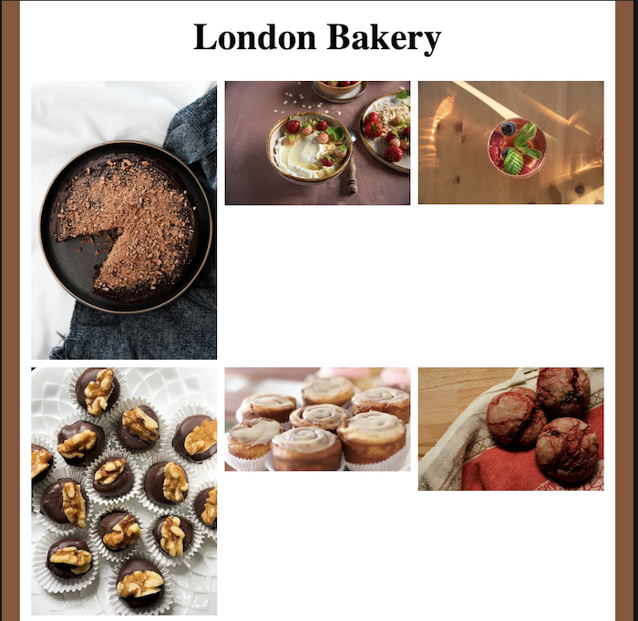

It’s not quite the sleek and stylish image gallery we want. Our masonry layout can’t handle images with varying aspect ratios. Why is this happening? Let’s take a look at the code:

<aside>
💡 Note: The next couple of paragraphs dives a little into the CSS layout algorithm, and while it helps a lot to understand the thought process, if you want to get to the code, you can jump straight to the next section.

</aside>

If you look back at the code above, you’ll notice that it’s not doing anything other than iterating over the list of images and rendering each image with a fixed width of `200` pixels. The fixed width is intentional, as we want the masonry component to have a uniformly wide set of columns. Without it, we get a not-so-great-looking interface that looks more like a broken jigsaw puzzle.


Before writing the code, it’s worth having a look at why the current layout doesn’t look great. We’ll also go step-by-step over some possible solutions, and why the masonry layout is great for our use case.

### The CSS Box Model

The fundamental rule underpinning all of CSS is that [everything is a box](https://learntheweb.courses/topics/box-model/#:~:text=Every%20single%20thing%20you%20target,the%20style%20of%20each%20box.). Every piece of HTML content has a width and height. By default, when our content is rendered to the page our elements are displayed with respect to one another. Elements won’t overlap as they give each other enough space to render. As a result, our initial code looks like this:

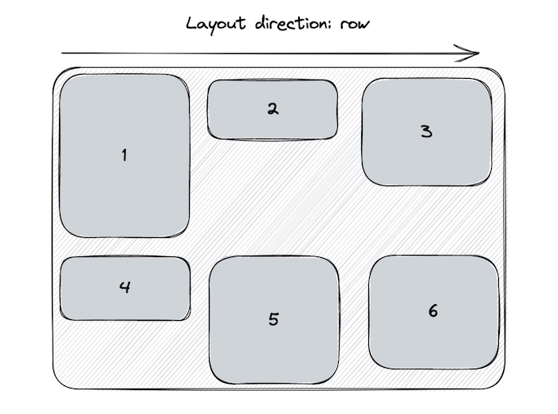

Bu why is there so much white space, surely CSS can work out that image 4 can fit in underneath image 2? Like so:

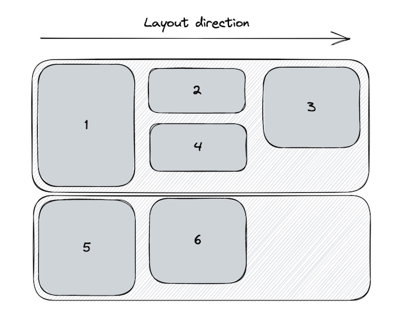

Sadly CSS can’t. Even though the images exist inside the same `div` container. The height of each row is calculated by the height of the tallest image in that row. As a result, we get some of that whitespace when a row contains images with differing heights.

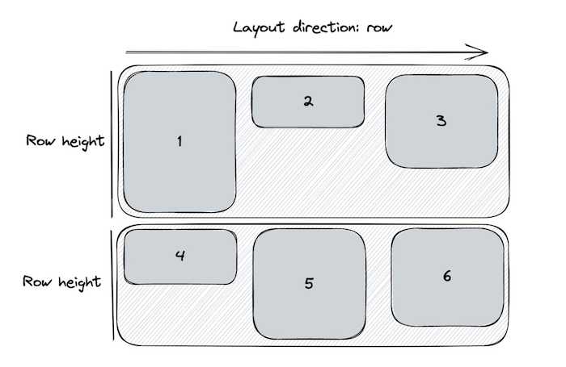

So if we think back to how everything in CSS is box, and that by default the CSS engine won’t reorder/overlap/collapse boxes to reduce white space. It makes sense why our images don’t render like the following:

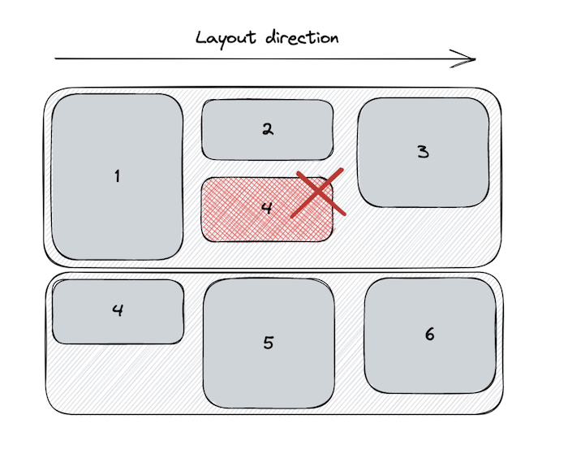

### CSS Flexbox

In the above examples, I’ve been using flexbox for image layout. [Flexbox](https://developer.mozilla.org/en-US/docs/Learn/CSS/CSS_layout/Flexbox) is a one-dimensional layout algorithm that does a lot of amazing things to help build layouts that accommodate the needs of the modern web. So if flexbox arranges our items in one-dimensionally, shouldn’t our images be displayed in a single line?

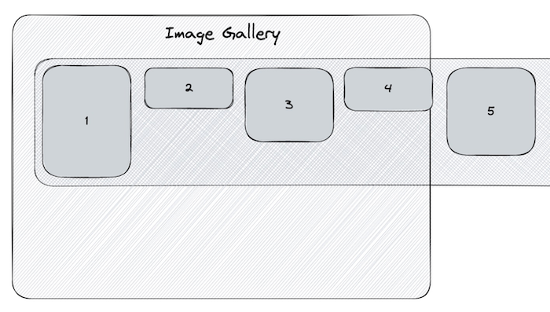

That’s completely right, and it’s exactly what happens, without the `flex-wrap: wrap` css value, which I’ve already applied. This means that our 1-dimensional layout can continue on the row below when the width of the content reaches the limit for a given row. With this surface level knowledge of the box model and flexbox, we can understand why our default CSS layout looks the way it does.

So what can we do about it? If you’ve used flexbox before, you might know that we can change the render direction of our content. We’ve been using `flex-direction: row` to generate the layout, but what happens when we render our content using`flex-direction: column`?

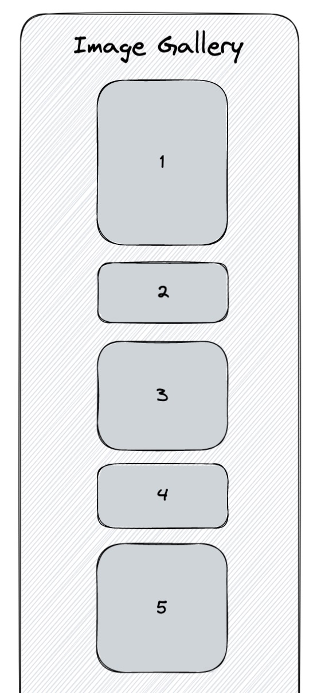

The column’s height stretches to accommodate the height of all our images. As a result, we’ll just see a single column with all of our images. The layout engine can’t split our images across an arbitrary number of rows. We _could_ set a fixed height on the container, which will generate columns as the height of our images reach the allotted height set by the container.

But this breaks our layout if our images reach reach the width and height limit of our container.

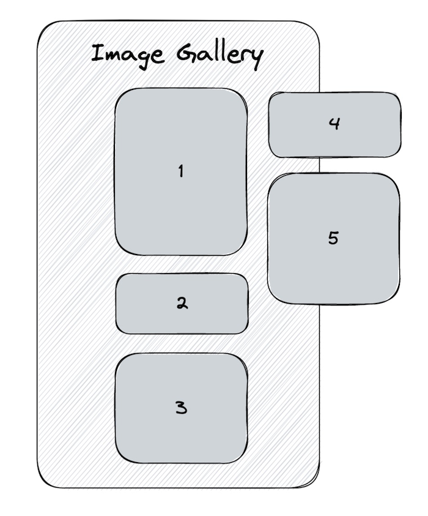

This won’t do! We need to add as many images as we want. We also want control over how many columns we generate instead of wholly relying on the CSS layout algorithm to guess what we want.

Sadly, CSS doesn’t have a built-in way to achieve this without writing some custom JavaScript. ([Unless you count the experimental Masonry Layout feature that’s only implemented in Firefox and is also behind a feature flag](https://developer.mozilla.org/en-US/docs/Web/CSS/CSS_Grid_Layout/Masonry_Layout))

That’s not a problem though, since we can write a little JavaScript to handle this. Luckily we can build on top of the amazing tools that CSS already gives us.

So what does our solution look like? Instead of relying on just 1 column to render our images, we’ll build as many columns as we like, and render them adjacently.

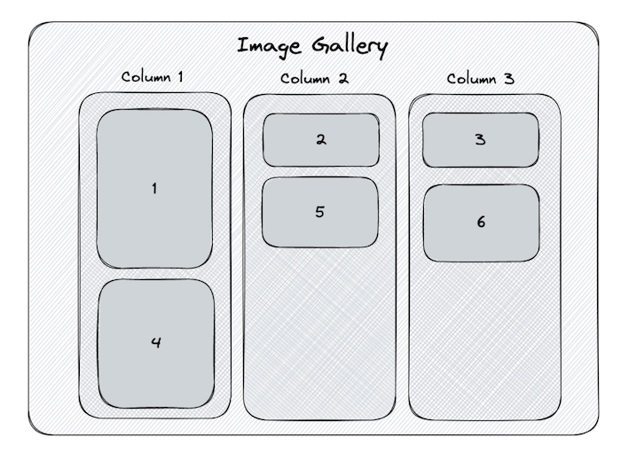

This is what we’ll achieve in step 1. As you can see though, this method is very inconsistent. We’re not assigning our images in a space efficient way. Instead, we’ll want our layout to do the following:

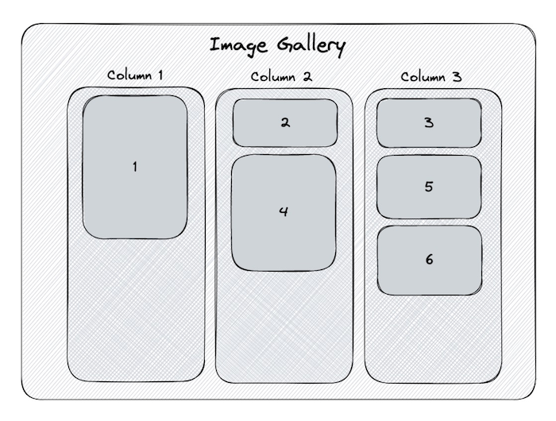

This is what we’ll achieve in step 2. We’ll alter the algorithm so we assign our image to the then shortest column.

## Step 1: Build and render the columns

This is what the first step of our masonry layout will look like:


How can we achieve this? There are only three things that we need to do:

1. Create an empty list of columns
2. Deal out the images across our columns
3. Render each column

### Create an empty list of columns

Let’s start by creating a function called `generateImageColumns`. It’ll take an argument of `images` and `columnCount`.

`images` is the list of images that’s currently being used to render the images. `columnCount` is used to specify the number of columns we want to generate.

```jsx
function generateImageColumns(images, columnCount = 3) {
  const columns = [...Array(columnCount)].map(() => [])

  // rest of logic

  return columns
}
```

The above might look like some funky JavaScript, but it’s a handy utility that allows us to initialise an array with a specific length + a default value.

`columns` will have a value of `[ [], [], [] ]` if we run the script with a `columnCount` of 3.

### Deal out the images across the columns

No we need to iterate over out list of images and add them to the corresponding column.

```jsx
function generateImageColumns(images, columnCount = 3) {
  const columns = [...Array(columnCount)].map(() => [])

  images.forEach((image, i) => {
    const columnToAddImageTo = i % columnCount
    columns[columnToAddImageTo].push(image)
  })

  return columns
}
```

Think of the loop like the dealer in a game of Uno. As the game starts they hand out a card to each player in a clockwise motion. Once they reach the last player, they go around the circle again until each player has enough cards.

When we get an image we add it to a column, we then add the next image to the next column. We keep adding images to columns until we get to the last column. Once we’ve run out of columns, we go back to the first and repeat the process until we have no images left.

### Render each column

This is where we take full advantage of CSS’s layout algorithms. We reuse the `renderImages` from the beginning of the article, but run it for each of the columns that we’ve built.

```jsx
function renderColumns(columns) {
  return columns.map((images, i) => {
    return <div className={styles.column}>{renderImages(images)}</div>
  })
}
```

We’ll also apply some CSS styles to set the `flex-direction` to `column`. This is done by providing the `className` prop with a value of `styles.column`. It applies the following CSS to the column:

```css
.column {
  display: flex;
  gap: 8px;
  flex-direction: column;
}
```

Let’s finally put it all together by calling `renderColumns`:

```jsx
export default function Masonry(props) {
  const { images, columnCount } = props
  const imageColumns = generateImageColumns(images, columnCount)

  return <div className={styles.container}>{renderColumns(imageColumns)}</div>
}
```

Great! We’ve lost all of the unnecessary white space between each row:


Not bad, but we can already see a flaw with this approach. With just a few more lines of code, we’ll dramatically improve our masonry layout!

## Step 2: Improve the column generation algorithm

So what’s the problem? Every third image, starting from the first, is much taller than the rest. As a result, the height of the first column is much larger than the other two. Instead of dealing our images out to each column in a round-robin style, we should add the image to the shortest column at that moment.

This is what we want our algorithm to do:

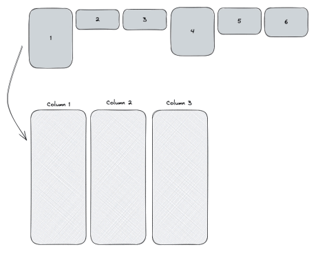

We need to adjust our code to do a little more than push the image to the next column. Now we’ll need to:

1. Find the column with the smallest height
2. Push the current image to that column
3. Get the height of the current image
4. Update the chosen column with the height of the image

### Find the column with the smallest height

Let’s start by tweaking our `generateImageColumns` function. The first thing we’ll do is create a new array that tracks the height of each column as we append an image to it.

```jsx
function generateImageColumns(images, columnCount = 3) {
  const columnHeights = Array(columnCount).fill(0)
  const columns = [...Array(columnCount)].map(() => [])

  // logic from before

  return columns
}
```

The value from `columnHeights[0]` corresponds to the array in `columns[0]` and so on.

Next we’ll add logic to calculate returns the column with the smallest height. We’re:

- finding the smallest value in `columnHeights`
- getting the index of the smallest value in `columnHeights`
- accessing the smallest column in `columns` using the index
- returning the smallest column

```jsx
images.forEach(image => {
  const smallestHeight = Math.min(...columnHeights)
  const indexOfSmallestHeight = columnHeights.indexOf(
    Math.min(...columnHeights)
  )

  const smallestColumn = columns[indexOfSmallestHeight]
  // 2. Push the image to the smallest column
  // 3. Get the height of the current image
  // 4. Update the chosen column with the height of the image
})
```

Then we can go ahead and push the image to the smallest column. Putting it all together looks like this:

```jsx
images.forEach(image => {
  const smallestHeight = Math.min(...columnHeights)
  const indexOfSmallestHeight = columnHeights.indexOf(
    Math.min(...columnHeights)
  )

  const smallestColumn = columns[indexOfSmallestHeight]
  smallestColumn.push(image)
  // 3. Get the height of the current image
  // 4. Update the chosen column with the height of the image
})
```

### Get the height of the current image

As we mentioned earlier on in the article. One of the challenges with handling lots of different images in your UIs is having to account for different image widths, heights, and aspect ratios.

To accurately calculate the height of the columns, we can’t just get the height of the image and append it to the heights already calculated. Instead we need to calculate the height of the image at the target width (200 pixels for this example).

To fit in our 200px columns the following images:

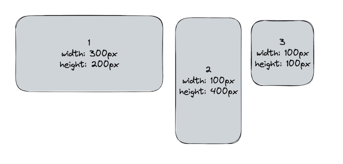

Would have heights 133px, 800px, and 200px respectively.

To calculate the relative height we need to whip up a little function:

```jsx
const getRelativeImageHeight = (image, targetWidth) => {
  const { width, height } = image
  const widthQuotient = targetWidth / width
  const relativeHeight = widthQuotient * height

  return relativeHeight
}
```

We then need to call this function inside of our loop:

```jsx
images.forEach(image => {
  const smallestHeight = Math.min(...columnHeights)
  const indexOfSmallestHeight = columnHeights.indexOf(
    Math.min(...columnHeights)
  )

  const smallestColumn = columns[indexOfSmallestHeight]
  smallestColumn.push(image)
  const height = getRelativeImageHeight(image, 200)
  // 4. Update the chosen column with the height of the image
})
```

### Update the chosen column with the height of the image

Finally, we just need to add one last line of code to get everything working.

We need to update the correct value in `columnHeights` with the new height.

It looks just like this:

```jsx
columnHeights[indexOfSmallestHeight] = smallestHeight + height
```

### Putting it altogether

Our final script looks like this:

```jsx
export default function Masonry(props) {
  const { images, columnCount } = props
  const imageColumns = generateImageColumns(images, columnCount)

  return <div className={styles.container}>{renderColumns(imageColumns)}</div>
}

const getRelativeImageHeight = (image, targetWidth) => {
  const { width, height } = image
  const widthQuotient = targetWidth / width
  const relativeHeight = widthQuotient * height

  return relativeHeight
}

function generateImageColumns(images, columnCount = 3) {
  const columnHeights = Array(columnCount).fill(0)
  const columns = [...Array(columnCount)].map(() => [])

  images.forEach(image => {
    const smallestHeight = Math.min(...columnHeights)
    const indexOfSmallestHeight = columnHeights.indexOf(
      Math.min(...columnHeights)
    )

    const smallestColumn = columns[indexOfSmallestHeight]
    smallestColumn.push(image)
    const height = getRelativeImageHeight(image, 200)
    columnHeights[indexOfSmallestHeight] = smallestHeight + height
  })

  return columns
}
```

And how does our gallery look? Have a look for yourself!


Even play around with the different screen sizes and see how the masonry layouts to when there are fewer columns. It’s really a wonderful pattern at handling images with an assortment of different widths and heights.

Please share any thoughts on ways to improve the masonry layout, or any creative ways you’ve implemented yours!
