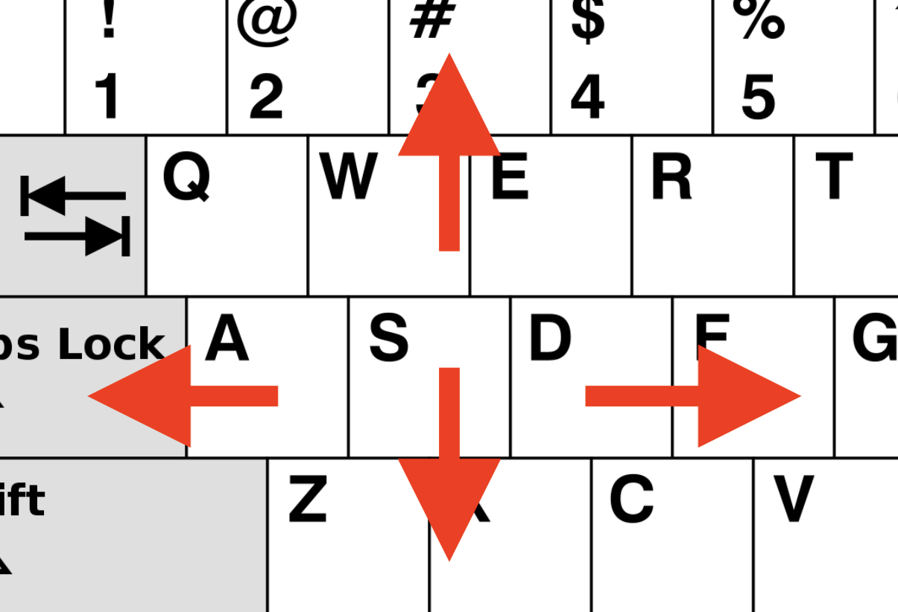
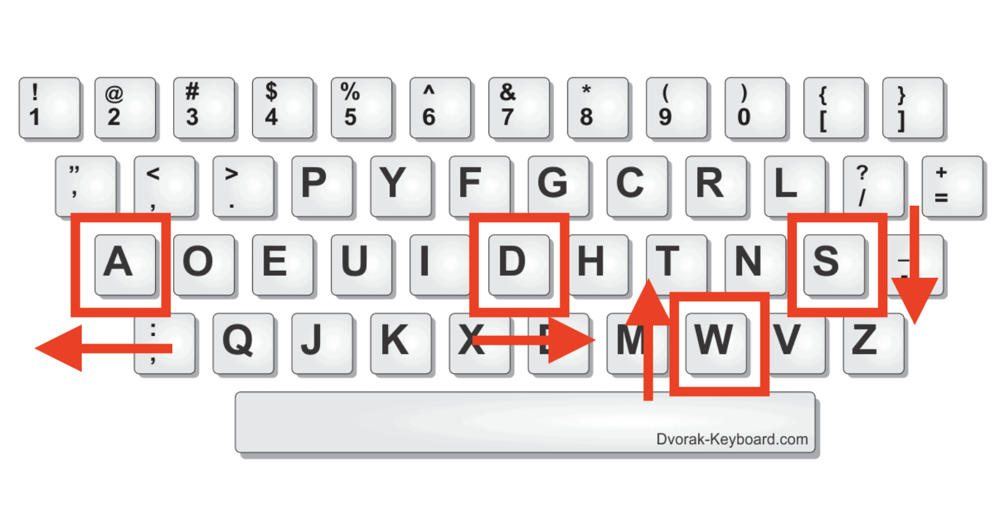

When handling keyboard events, the `event` object (or `e` for short) will contain more than one property to help you determine which key the user pressed. These properties are `e.key`, or `e.code`. If you’re like me, you’ve often forgotten the differences between the two properties. While you can get away with using one over the other in many cases, it’s important to understand the distinction since both `e.code` and `e.key` work best under specific circumstances.

## What is e.code?

This represents the physical _key_ on the keyboard, not the value that pressing the key will generate. Consider the following scenario:

> You have an English language QWERTY keyboard, but often toggle the language to Greek. With the English layout being enabled, pressing the “l” key will result in the `e.code` being “KeyL”. With the Greek layout enabled, pressing the “λ” will still result in the `e.code` ”KeyL”.

Note: the value given to us by `e.code` does not take modifier keys (like shift, ctrl, etc.) into consideration.

You can even play around with [some code to become more familiar](https://codesandbox.io/s/dawn-fire-p4jm4s?file=/index.html)

## What is e.key?

```jsx
document.addEventListener("keydown", e => console.log("Key - ", e.key))
```

This is the way to go if you need the digital value of the keyboard that’s been pressed. If you’re prompting someone to write their name, then you want the value outputted to the computer to match the value that the user inputted, regardless of language or keyboard layout.

Try changing your keyboard layout to [DVORAK](https://dvorak-keyboard.com/), and you’ll see that instead of printing out the physical representation of the key, it prints out the digital representation of the key, i.e., the character that you expect to be printed to the screen when you press it.

## How do I choose which one to use?

You need to ask yourself "is the action is language specific?"

If you’re creating a controlled input for a text field, you’ll want to use `e.key` as it maps to the digital representation of the physical key. Regardless of which keyboard layout or keyboard language a user is using, `e.key` will capture the user’s literary intent.

If this is all too abstract, the table below shows how different keyboard layouts are handled using `e.key` and `e.code`.

|        | QWERTY                    | DVORAK                    |
| ------ | ------------------------- | ------------------------- |
| e.key  | Hello, my name is Andrico | Hello, my name is Andrico |
| e.code | hello, my name is andrico | d.nnrw mf bam. co abepcjr |

<aside>
💡 The literal output for `e.code` would look like “KeyA”, “KeyL”, or “KeyO”. So the above example assumes that we’ve done a little processing to match the code to a character.
</aside>

So if using `e.code` outputs gibberish for anything other than the QWERTY, why would we ever want to use it? `e.code` is great for handling actions that are not language-specific and instead related to the physical layout of the keyboard.

A great example is creating the controls for a browser game. You’d normally move your character using the `w`, `a`, `s`, `d` keys. This makes sense because on a QWERTY keyboard layout, they make a nice arrow.



For someone who’s playing games using a DVORAK keyboard layout, `w`, `a`, `s`, `d` makes no sense whatsoever:



<aside>
💡 Allowing people to remap keys and shortcuts on websites massively helps <a href="https://www.w3.org/WAI/WCAG21/Understanding/character-key-shortcuts">improve accessibility</a>
</aside>

## Wrapping up

If the action is language-specific, such as creating a controlled input for a text field, `e.key` should be used. If the action is not language-specific, such as creating controls for a browser game, `e.code` is a better choice. If you have the resources to do so, allow your users to remap keys and shortcuts on your sites; it’s a big accessibility win.
