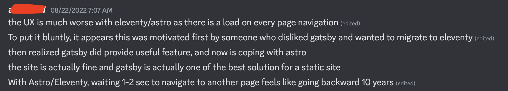
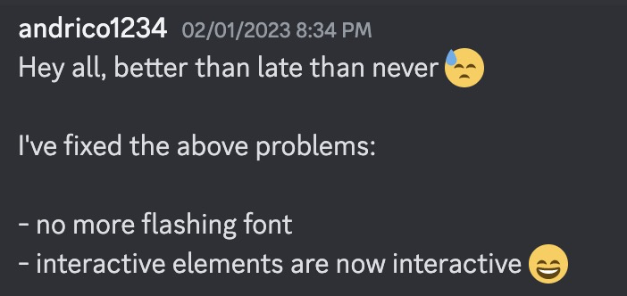
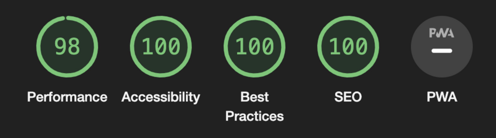
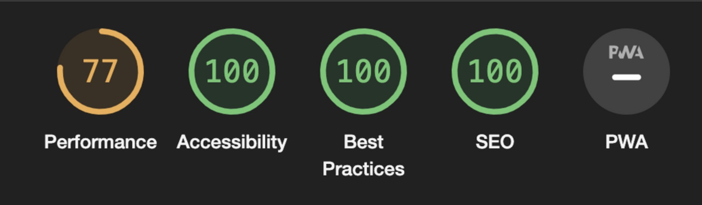
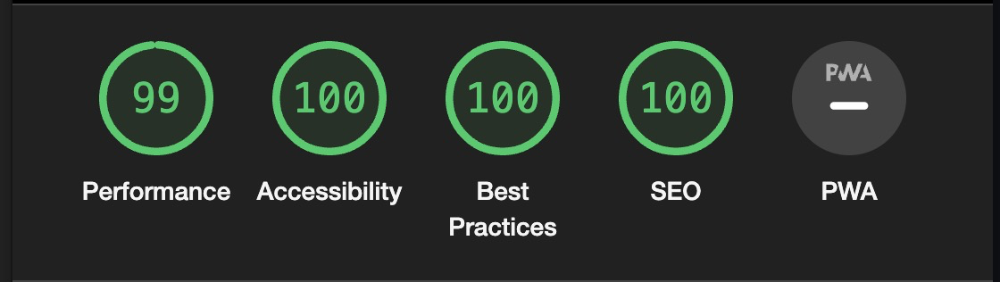
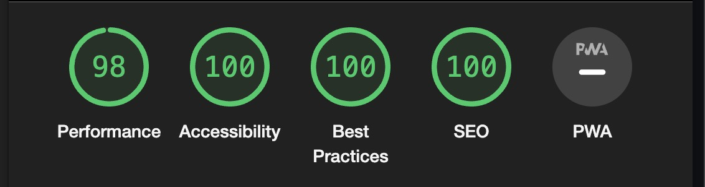

## What's The Open UI?

For the last three years UI/UX Designers, web developers, browser engineers, content designers, and product managers have all come together as part of the Open UI community group to design the specs for some of the most eagerly anticipated browser features.

Upcoming features like the Select Menu and Popover are designed for web developers like me (and likely you) to create user interfaces that are more robust, accessible, easier to build,. and rely less on external JavaScript.

Every week, when the group gets together, they discuss and make adjustments to these specs. A member of the group will then update the Open UI site to reflect these changes.

The Open UI site isn’t easy to develop for. People looking to make changes to the site have found themselves running up against dependency issues, complex JSX code, and a need to learn the Gatsby framework.

Even with the Open UI site being a static site with small splashes of interactivity, loading the homepage is a huge 2.2mb! (2.0mb of JavaScript).

With that in mind, working closely with a few members of the group, I planned and executed a migration of the Open UI site from Gatsby to Astro in the hopes of achieving these three goals:

- The Open UI site should be easy to maintain and contribute to.
- Visitors to the Open UI site deserve an excellent web experience.
- The Open UI site should be built on a core of HTML, CSS, and Markdown, with JavaScript added as necessary.

## The Open UI site should be easy to maintain and contribute to

To really make the most out of the amazing breadth of knowledge that everyone involved in Open UI has, we need to make the barrier for entry to contribute to the site as low as possible.

The Open UI site sounds simple enough, a static content site with some splashes of interactivity. But even then, someone wanting to make a text change will run into a whole bunch of issues:

- Installing dependencies has been a pain for a number of contributors.
- The JSX components are often more complex than necessary
- The Gatsby framework requires knowledge of React and GraphQL

Asking a team of volunteers to learn two discrete (and often challenging) technologies to make changes to a static site is a tall order. No one should need to know the difference between a `gatsby-node`, `gatsby-browser` and a `gatsby-config` file.

## Those visiting the Open UI site deserve an excellent web experience

The Open UI site has tens of thousands of monthly visitors from all around the world, with little consistency in device power and internet strength. Those on lower-end tech should still be given a smooth web experience.

A framework like Gatsby offers a good core experience. In fact, it was the React framework that popularized server-side rendering to a static site. A few years back, It made a lot of sense for a content-driven site like the Open UI site to use Gatsby.

However, we were still sending a huge bundle of JavaScript to our visitors on page load. The only interactivity on the home page is a navigation menu toggle button. Even then it’s only visible on small screen devices. 2.1mb for something many people would never see is eye-watering.

[](https://s3-us-west-2.amazonaws.com/secure.notion-static.com/0a42fe48-6013-4912-9e9f-a855a288c9d4/toggle-button.mov)

Is this worth 2.1mb?

One of Astro’s selling points is only loading and parsing the necessary JavaScript on the page when it’s needed. This is perfect for a site like the Open UI that requires very little JavaScript.

## The Open UI site should be built on a core of HTML, CSS, and Markdown, with JavaScript as necessary

GraphQL and React both have their place in web development, but for a simple content-driven site like Open UI, we should work more closely with the browser platform.

We want the technology used for building our site to feel congruent with the goals of the Open UI group. We want to better leverage the native browser platform and avoid extra technologies that go against that.

Migrating to Astro isn’t a panacea solution since we’re moving over to Astro’s templating language. The Astro template language does have a few [quality of life improvements](https://docs.astro.build/en/core-concepts/astro-components/#differences-between-astro-and-jsx) that make it feel closer to HTML than JSX, but it is still another thing for someone to learn.

## Planning phase

> “It takes just as much time to build the wrong thing as it does the right thing”.

How many times have you been involved in any sort of technical project and:

- You or your team hit a roadblock every 5 minutes.
- New requirements came in as more stakeholders got involved.
- There was no discernible completion point.
- The rollout strategy was nebulous or non-existent.

I’ve worked on many projects (both as a lead and contributor) that fell apart due to a weak planning phase. There’s often pressure to start coding as soon as possible without giving the problem space a second thought. I wanted to ensure that I, and anyone else involved in the migration, wouldn’t run into the above problems.

I’m a big believer in spending upfront time doing research, building prototypes and validating hypotheses before touching any production code.

Before beginning the work in earnest, I need to try and:

- Establish a very clear cut-off point
- Understand all potential roadblocks
- Make a clear rollout strategy

This isn’t always easy, and there will always be roadblocks, unknowns, and requirements that make themselves apparent once the project is well underway. This section dives deeper into all the steps in preparation for migrating the codebase.

### Establishing requirements, goals, and out-of-scope work

Write a list of all the things you want to add to a project. Ask a developer all the things that they want to add to a project. Repeat this with product managers, users, and stakeholders. Congratulations, you’ve got a backlog! And it’s only going to get bigger with time.

To avoid finding yourself with a bloating set of requirements, it’s important to be clear about what will and won’t be included as part of the initial release. The same went for the migration, I was very clear from early on that the following would not be part of the initial migration:

- Making our CSS solution consistent
- Migrating all non-interactive JSX components to the Astro templates
- Upgrading all of our dependencies
- Updating the folder hierarchy of the project
- Simplifying complex parts of the site that were not part of the critical path

The people you’re working closely with will have amazing ideas for things to change and add, and it’s important to look at all of these with a critical eye, and communicate clearly whether it’s something that’ll be part of the initial release or something we can add later.

In fact, many of these “phase 2” \*\*or “post-release” features make for great first issues for new contributors because they’re often not fundamental changes to how the site operates.

### Non-technical concerns

There’s a phrase I’ve heard that goes, “the best code written is no code at all”. I didn’t want to waste the time and energy of the Open UI group, so I asked the following questions:

- Will migrating the platform offer a net-positive result?
- Is a migration even necessary?
- Will Astro introduce different problems for contributors?
- What if the migration takes too long and I’m no longer willing or able to complete it?
- Would time be better spent working on other changes to improve the Open UI site?

We, as humans, have a tendency to want to complete things that we’ve invested time and energy in, even if it’s not the right thing. I didn’t want the time spent on research to be a critical factor for whether we migrate the site. If I had spent a week researching for the migration and the Open UI team decided there was a better use of development time, I would have been content.

Fortunately, it didn’t come to this and the migration went off without a major hitch. Hopefully the Open UI’s tweet says it all:

<blockquote class="twitter-tweet"><p lang="en" dir="ltr">A huge shoutout to <a href="https://twitter.com/AndricoKaroulla?ref_src=twsrc%5Etfw">@AndricoKaroulla</a> for re-platforming our site to <a href="https://twitter.com/astrodotbuild?ref_src=twsrc%5Etfw">@astrodotbuild</a>. This has simplified our site quite drastically to enable us to now do some changes we&#39;ve been wanting to do for a while. Thank you Andrico!!<br><br>~ Everyone in Open UI</p>&mdash; Open UI (@openuicg) <a href="https://twitter.com/openuicg/status/1630606036792152066?ref_src=twsrc%5Etfw">February 28, 2023</a></blockquote>

### Picking the right framework

The words “feature parity” send shivers down my spine whenever uttered within the context of a rewrite. When picking a framework, it was important to not expect 1:1 feature parity, but to ensure that it offered our visitors an equivalent (or better) experience. For example, maybe Gatsby’s image preprocessing is the best on the market. Does that really matter if the new framework affords us ways of keeping the site and image loading experience snappy?

There may have certainly been other things that Gatsby does better, there are downsides and tradeoffs for every choice. There’s no perfect solution, and when evaluating the various frameworks, I kept coming back to the three guiding principles to help me make decisions for tough dilemmas.

I wasn’t planning on using Astro to begin with. I had a list of prospective frameworks and took a week to build a prototype with each of them. The outcome was to see how easy it would be to build a site similar to Open UI, and whether it would still satisfy the three guiding principles. The three frameworks I evaluated were:

- [Rocket](https://rocket.modern-web.dev/)
- [Astro](https://astro.build/)
- [Eleventy](https://www.11ty.dev/)

When weighing up these options I looked at things like, migrating components, rendering content, handling static assets, etc.

While we didn’t go ahead with Rocket or Eleventy, I do want to give those frameworks a shoutout, because I think they’re both great, with a lot of love put into them by their authors and respective communities.

So why did I choose Astro? The next few sections will describe why Astro offered the easiest migration path while satisfying the 3 core principles.

### Markdown support

The Open UI is a content-driven website. The content itself exists as markdown and MDX that lives within the repo. Astro has support for the former out of the box, while the latter only requires the inclusion of a first-party plugin. Something I only realised during development, and kindly pointed out to me by Jon Neal, is that [markdown comes in a variety of different flavours](https://gist.github.com/vimtaai/99f8c89e7d3d02a362117284684baa0f). My concern wasn’t whether Astro supported markdown, but whether their flavour was compatible with the flavour of markdown used by Gatsby.

I copied over our most complex markdown page over to a test Astro site to measure compatibility. After making a few syntax changes to our MDX, it worked perfectly.

As expected, a few omissions were discovered after the initial release. For example, Mason Freed later discovered that Astro doesn’t apply heading links automatically for markdown files. With the initial release out of the way, other members of the community can step in and take on these challenges, like Andrii Kurdiumov who has just [reimplemented it](https://github.com/openui/open-ui/pull/678). 🙌🏼

### Site navigation

One of the more complex parts of the Gatsby Open UI site was the way we query the file system to build our navigation component.

Have a look at the GraphQL query:

```jsx
const Navigation = () => (
  <StaticQuery
    query={graphql`
      query NavigationQuery {
        allMdx {
          edges {
            node {
              frontmatter {
                path
                name
              }
            }
          }
        }
      }
    `}
    render={data => {
      const pageDetails = _.map(data.allMdx.edges, "node.frontmatter")

      return <NavigationContent pageDetails={pageDetails} />
    }}
  />
)
```

For anyone familiar with GraphQL, this is a common pattern for writing a query, but:

- It requires understanding React’s “render props” pattern
- It requires several lines with no OOTB intellisense
- Accessing markdown content requires knowledge of how GraphQL structures it internally. e.g., allMdx, edges, node, etc.

Am I just going to swap out one complex query language for another?

Does Astro only **seem** less complicated to me because I’m taking a lot of time to learn it?

The Open UI has a very simple content strategy, so getting a list of all the resources was as simple as using “[Astro.glob](https://docs.astro.build/en/reference/api-reference/#astroglob)”.

```jsx
---
const pageDetails = await Astro.glob('../../pages/**/*.(md|mdx)');
---

<NavigationContent pageDetails={pageDetails} />
```

<blockquote class="twitter-tweet"><p lang="en" dir="ltr">Sex is great and all, but have you replaced dozens of lines of GraphQL config with one call to Astro.glob()?<a href="https://twitter.com/astrodotbuild?ref_src=twsrc%5Etfw">@astrodotbuild</a> <a href="https://t.co/YGD51K5ZFv">pic.twitter.com/YGD51K5ZFv</a></p>&mdash; Andrico Karoulla (@AndricoKaroulla) <a href="https://twitter.com/AndricoKaroulla/status/1635021473479032833?ref_src=twsrc%5Etfw">March 12, 2023</a></blockquote>

### Migrating styles

The Open UI codebase doesn’t have a consistent way of handling styles. This isn’t a framework-specific issue, instead it’s come about due to a number of different contributors making changes to the codebase over a number of years. Some of the styling approaches we had were:

- Global CSS files
- Usage of typography.js, a tool that turns config into styles at build time
- Component level CSS files
- Inline CSS
- and more…

While consolidating all of the styling options was beyond the scope of this migration, I was worried that one or more of the above solutions wouldn’t work and we’d end up having to make even more changes to ensure that the styles worked.

The fewer files I touched the better.

In fact, we’re not much better off now, but we did to get rid of the typography.js implementation, which was previously handled via a Gatsby plugin. Ultimately, we’re still left with 4 different CSS approaches:

- Global CSS
- CSS in Astro components
- Component level CSS files for JSX
- Inline CSS (only when necessary)

After completing the migration we can work on things not on the critical path, like [making the CSS solution more consistent across the Open UI site](https://github.com/openui/open-ui/issues/674)

### Image optimisation

Gatsby has always treated images as first-class citizens.

With that said, when I was first exploring Astro for use in the Open UI, (pre 1.0), there was no official image plugin.

This may have been our first major concession, how could we offer an equivalent experience without adding additional complexity to the development experience?

If we couldn’t have the same level of image optimisation, we could do a few things ourselves to keep things speedy for our visitors. Ultimately, we opted for:

- Lazy loading in images, via the `loading="lazy"` attribute
- Adding an extra step to the build pipeline to compress our assets

### Ease of deployment

Static sites generally have it easy when it comes to deployments. We don’t need a long running server, we just need our hosting provider to run a build script and serve the output.

With that said, I have had issues in the past with certain plugins, dependency versions, and scripts working locally but failing in the CI pipeline. At the beginning of the project, always ensure that you can easily to test in-progress versions of the site in a production-like environment.

We use Netlify to handle this, and it’s GitHub integration is perfect. Only a couple of configuration changes were required to get things up and running. Netlify is my go-to deployment tool and I’d recommend for anyone that is looking to deploy their static site.

### Rollout phase

Even with the hard work over, and after all the tough decisions have been made, you may still run into some friction. It’s not too uncommon for people to raise concerns well into development.



Tucked away in this **blunt** feedback, this person raised a good point. The site didn’t feel quite as fast as our previous implementation. Sadly, the moment I reached out for them to join our fortnightly feedback call or offer suggestions for improvements they went radio silent.

Had I wasted my, and the group's, time?

Had my planning gone so wrong that our visitors will soon be subjected to an awful web experience?

Luckily members of the [greater web community were quick in helping me resolve this problem](https://github.com/withastro/astro/issues/5458).

Fortunately, there were no other nasty surprises. In fact, thanks to the time taken during the research phase, I was able to code pretty much non-stop with very little in the way of friction.

Even after all that coding, things aren’t done yet. The rollout phase can be a tall hurdle to jump over. Fortunately, the Open UI team were involved with the QA, and managed to discover a number of smaller problems. I want to give thanks to the folks who spotted things I missed, including:

- IDs and links to headers - Thanks Mason
- Handling page redirects + content flashing - Thanks Jon Neal
- Image + Link accessibility improvements - Thanks Ben
- aria-\* attributes not updating when they should be - Thanks Jhey
- helping keep momentum going and helping keep the migration focused - Thanks Greg



## Outcomes

So was the outcome of migration worth the effort?

The results are pretty striking:

|                                | Gatsby (desktop) | Astro (desktop) | Gatsby (mobile) | Astro (mobile) |
| ------------------------------ | ---------------- | --------------- | --------------- | -------------- |
| Initial bundle size            | 2.2mb            | 322kb           | 2.2mb           | 322kb          |
| JS downloaded on homepage load | 2mb              | 63kb            | 2mb             | 63kb           |
| Time to interactive            | 2.3s             | 0.4s            | 13.4s           | 1.5s           |
| First contentful paint         | 0.4s             | 0.4s            | 1.9s            | 1.5s           |
| Cumulative layout shift        | 0.068            | 0.084           | 0.016           | 0.091          |
| Largest contentful paint       | 2.4s             | 0.4s            | 2.9s            | 1.5s           |

Some of the biggest takeaways from the table are:

- A massive reduction of JavaScript downloaded and parsed on homepage load
- A significant improvement to site load speed.

Lighthouse scores below, but a number of folks testing the site said themselves that the site felt snappier.

### Lighthouse scores

#### Gatsby (desktop)



#### Gatsby (mobile)



##### Astro (desktop)



#### Astro (mobile)



Let’s review our three guiding principles, and determine whether we hit them:

**Those visiting the Open UI site deserve an excellent web experience**

It’s very clear from the metrics above that we delivered on this. The page feels snappier, and we’re delivering much less JS to download and parse for our users.

**The Open UI site should be built on a core of HTML, CSS, and Markdown, with JavaScript as necessary.**

Thanks to Astro’s templating language, we’re able to serve our content to users with much less reliance on JavaScript and React. We can go even further and massively reduce the amount of JavaScript we’re using on the page.

**The Open UI site should be easy to maintain and contribute to**

This one’s a little up in the air. While Astro reduces a lot of the complexities that came along with Gatsby, there are still a number of gotchas that might trip up new developers. With that said, we’ve already had contributions to the new site. These contributions don’t include content changes, but changes to the codebase and add new features.

## A final thanks

I already gave a shout out to some folks already, but would like to say thanks to everyone in the Open UI group who took the time to offer their time, suggestions, and feedback.

Especially to Greg for chairing the Open UI group, and making it a wonderful group to be a part of.